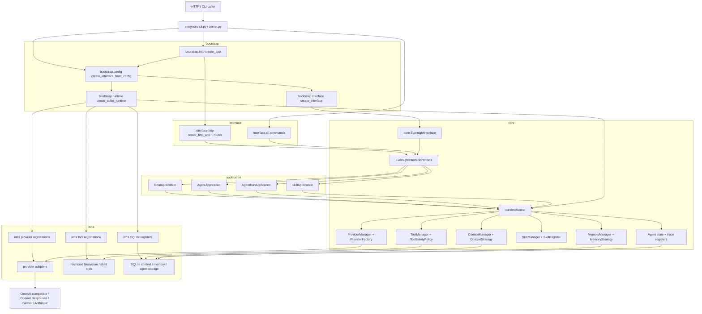

# EvernightAI

EvernightAI is a small layered runtime for chat providers, skills, tools,
context, memory, and agent runs.

The main runtime loop is:

```text
RuntimeKernel -> ChatApplication -> ProviderManager -> OpenAI-compatible adapter
-> real provider -> response mapper -> ChatResponse
```

## Architecture

EvernightAI keeps external interfaces very thin. HTTP and CLI code receive an
already assembled interface/runtime and translate transport requests into core
schemas. Application code coordinates use cases through protocols. Infra code
owns concrete adapters and registrations. Bootstrap code owns concrete
composition: it names application services, concrete adapter registrations,
runtime stores, and HTTP app factories. Entrypoints ask bootstrap for assembled
objects instead of wiring the graph themselves. Inside bootstrap, application,
infra, and interface components are treated as assembled roles under the
composition boundary. Bootstrap treats them uniformly while composing the
system.



The dependency direction is intentionally one-way:

```text
interface -> core protocols/schemas
application -> core protocols/schemas
infra -> core protocols/schemas
bootstrap -> application + infra + interface assembly
entrypoint -> bootstrap + interface command/process startup
```

Bootstrap has four explicit assembly points:

- `bootstrap.runtime` assembles `RuntimeKernel`, skill/tool managers,
  provider/tool registrations, and concrete storage registers.
- `bootstrap.interface` wraps a runtime with application services and
  `EvernightInterface`, including `SkillApplication`.
- `bootstrap.config` turns an `EvernightConfig` into an assembled runtime or
  interface.
- `bootstrap.http` turns an assembled interface into a FastAPI app.

The current HTTP surface includes provider management, context and memory CRUD,
skill listing and rendering, tool listing, direct chat, context chat, SSE chat
streaming, persisted agent runs, persisted agent trace streaming, and agent
resume.

Chat streaming has an internal `ChatStreamProtocol` and `ChatStreamEvent`
schema. SSE is only the HTTP transport encoding used by the current HTTP route;
provider adapters first map provider-specific stream chunks into chat stream
events, normalizing text deltas, tool-call deltas, completed tool calls, usage,
and completion events when possible. Chunks that cannot be safely normalized are
kept as raw events. The HTTP layer serializes chat stream events to SSE.

Bootstrap registers a small built-in `echo` skill by default so the skill
registry has an end-to-end smoke path before external skill sources are added.
Skills render prompt messages; tools execute external actions.
Chat and agent requests may declare skills. Application orchestration renders
those declarations into prompt messages before the provider call and keeps the
rendered messages out of stored context history.

## Project Rules

These rules are intentionally backed by tests.

- Core code must not depend on application or infra code.
- Application code must not depend on infra code.
- Interface code must not assemble application services or concrete infra
  runtimes.
- Inner layers must not depend on bootstrap modules.
- Only bootstrap may assemble application services with concrete runtime
  adapters and stores.
- Inside bootstrap, application, infra, and interface components follow the
  bootstrap composition boundary and are treated uniformly as assembled roles.
- Entrypoint code must not depend on concrete infra modules.
- Concrete infra imports should stay inside `infra` and package-level
  `bootstrap`.
- Package `__init__.py` files stay comment-only.
- OpenAI-compatible chat calls must not require a remote `/models` endpoint.
- OpenAI-compatible chat and stream calls may use a request model id that was not
  predeclared in `ProviderConfig.model`.
- Real provider tests are opt-in and skipped by default.
- Real provider unavailability is a skip, not a local integration failure.
- Pytest should show skip reasons in the short summary.

## Local Checks

```powershell
.\.venv\Scripts\python.exe -m pytest
.\.venv\Scripts\pyright.exe
```

## Real Provider Smoke Test

The real provider test verifies the full provider loop against an
OpenAI-compatible endpoint. It is disabled unless explicitly enabled.

```powershell
$env:EVERNIGHTAI_RUN_REAL_OPENAI="1"
$env:EVERNIGHTAI_REAL_OPENAI_API_KEY="your-key"
$env:EVERNIGHTAI_REAL_OPENAI_MODEL="deepseek-chat"
$env:EVERNIGHTAI_REAL_OPENAI_BASE_URL="https://your-openai-compatible-endpoint/v1"
.\.venv\Scripts\python.exe -m pytest tests\test_real_openai_flow.py -m real_openai
```

`EVERNIGHTAI_REAL_OPENAI_BASE_URL` may be omitted when using the default OpenAI
API endpoint. `OPENAI_API_KEY` and `OPENAI_BASE_URL` are also supported as
fallbacks.
