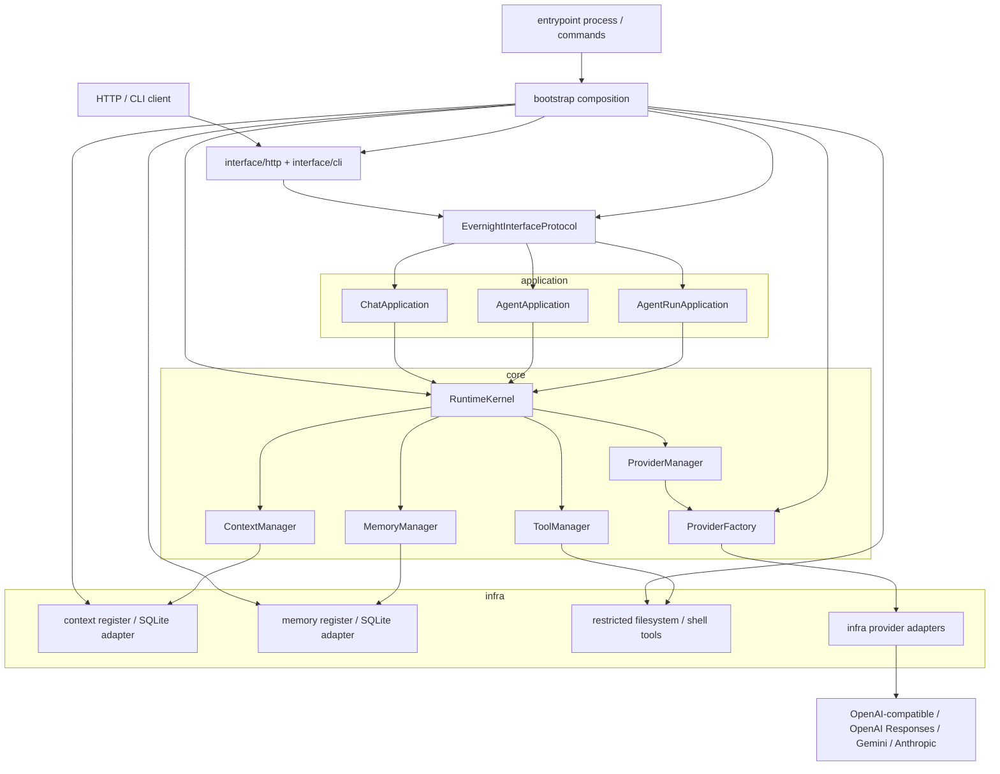

# EvernightAI

EvernightAI is a small layered runtime for chat providers, tools, context,
memory, and agent runs.

The main runtime loop is:

```text
RuntimeKernel -> ChatApplication -> ProviderManager -> OpenAI-compatible adapter
-> real provider -> response mapper -> ChatResponse
```

## Architecture

EvernightAI keeps external interfaces very thin. HTTP and CLI code receive an
already assembled interface/runtime and translate transport requests into core
schemas. Application code coordinates use cases through protocols. Infra code
owns concrete adapters and registrations. Bootstrap code owns concrete
composition: it names application services, concrete adapter registrations,
runtime stores, and HTTP app factories. Entrypoints ask bootstrap for assembled
objects instead of wiring the graph themselves.



The dependency direction is intentionally one-way:

```text
interface -> core protocols/schemas
application -> core protocols/schemas
infra -> core protocols/schemas
bootstrap -> application + infra + interface assembly
entrypoint -> bootstrap + interface command/process startup
```

The current HTTP surface includes provider management, context and memory CRUD,
tool listing, direct chat, context chat, SSE chat streaming, persisted agent
runs, persisted agent trace streaming, and agent resume.

## Project Rules

These rules are intentionally backed by tests.

- Core code must not depend on application or infra code.
- Application code must not depend on infra code.
- Interface code must not assemble application services or concrete infra
  runtimes.
- Inner layers must not depend on bootstrap modules.
- Only bootstrap may assemble application services with concrete runtime
  adapters and stores.
- Entrypoint code must not depend on concrete infra modules.
- Concrete infra imports should stay inside `infra` and package-level
  `bootstrap`.
- Package `__init__.py` files stay comment-only.
- OpenAI-compatible chat calls must not require a remote `/models` endpoint.
- OpenAI-compatible chat and stream calls may use a request model id that was not
  predeclared in `ProviderConfig.model`.
- Real provider tests are opt-in and skipped by default.
- Real provider unavailability is a skip, not a local integration failure.
- Pytest should show skip reasons in the short summary.

## Local Checks

```powershell
.\.venv\Scripts\python.exe -m pytest
.\.venv\Scripts\pyright.exe
```

## Real Provider Smoke Test

The real provider test verifies the full provider loop against an
OpenAI-compatible endpoint. It is disabled unless explicitly enabled.

```powershell
$env:EVERNIGHTAI_RUN_REAL_OPENAI="1"
$env:EVERNIGHTAI_REAL_OPENAI_API_KEY="your-key"
$env:EVERNIGHTAI_REAL_OPENAI_MODEL="deepseek-chat"
$env:EVERNIGHTAI_REAL_OPENAI_BASE_URL="https://your-openai-compatible-endpoint/v1"
.\.venv\Scripts\python.exe -m pytest tests\test_real_openai_flow.py -m real_openai
```

`EVERNIGHTAI_REAL_OPENAI_BASE_URL` may be omitted when using the default OpenAI
API endpoint. `OPENAI_API_KEY` and `OPENAI_BASE_URL` are also supported as
fallbacks.
