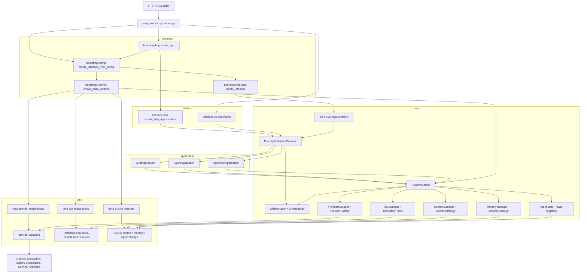

# EvernightAI

EvernightAI is a small layered runtime for chat providers, skills, tools,
context, memory, and agent runs. Image generation through OpenAI-compatible
providers supports background tasks, partial editing, and creation within chat.
The image workspace is a view of the chat page at `/chat.html#images`; see [Image Generation](docs/image-generation.md).
Web chat also accepts PNG, JPEG and WebP image attachments through file
selection, drag and drop, or clipboard paste. Uploaded images are stored as
file references and resolved for each model call across all four provider
types. See [Image Input](docs/http-api.md#image-input).

The main runtime loop is:

```text
RuntimeKernel -> ChatApplication -> ProviderManager -> OpenAI-compatible adapter
-> real provider -> response mapper -> ChatResponse
```

## Architecture

For a directory and feature navigation guide, see the
[project structure guide (Chinese)](docs/project-structure.md).
Detailed relationships are in the [dependency architecture](docs/architecture-dependencies.md)
and [architecture diagrams](docs/architecture-diagrams.md).

EvernightAI keeps external interfaces very thin. HTTP and CLI code receive an
already assembled interface/runtime and translate transport requests into core
schemas. Application code coordinates use cases through protocols. Infra code
owns concrete adapters and registrations. Bootstrap code owns concrete
composition: it names application services, concrete adapter registrations,
runtime stores, and HTTP app factories. Entrypoints ask bootstrap for assembled
objects instead of wiring the graph themselves. Inside bootstrap, application,
infra, and interface components are treated as assembled roles under the
composition boundary. Bootstrap treats them uniformly while composing the
system.


```mermaid
flowchart TD
    Caller["HTTP / CLI caller"] --> Entrypoint["entrypoint cli.py / server.py"]

    Entrypoint --> BootHTTP["bootstrap.http create_app"]
    Entrypoint --> BootConfig["bootstrap.config create_interface_from_config"]
    BootHTTP --> BootConfig
    BootHTTP --> HTTPApp["interface.http create_http_app + routes"]

    Entrypoint --> CLICommands["interface.cli commands"]
    HTTPApp --> InterfaceBoundary["EvernightInterfaceProtocol"]
    CLICommands --> InterfaceBoundary

    BootConfig --> BootInterface["bootstrap.interface create_interface"]
    BootConfig --> BootRuntime["bootstrap.runtime create_sqlite_runtime"]
    BootInterface --> InterfaceImpl["core EvernightInterface"]
    InterfaceImpl --> InterfaceBoundary

    InterfaceBoundary --> ChatApp["ChatApplication"]
    InterfaceBoundary --> AgentApp["AgentApplication"]
    InterfaceBoundary --> AgentRuns["AgentRunApplication"]
    InterfaceBoundary --> Skills

    ChatApp --> Runtime["RuntimeKernel"]
    AgentApp --> Runtime
    AgentRuns --> Runtime
    BootRuntime --> Runtime

    Runtime --> Providers["ProviderManager + ProviderFactory"]
    Runtime --> Contexts["ContextManager + ContextStrategy"]
    Runtime --> Memories["MemoryManager + MemoryStrategy"]
    Runtime --> Skills["SkillManager + SkillRegister"]
    Runtime --> Tools["ToolManager + ToolSafetyPolicy"]
    Runtime --> AgentStore["Agent state + trace registers"]

    BootRuntime --> ProviderRegs["infra provider registrations"]
    BootRuntime --> ToolRegs["infra tool registrations"]
    BootRuntime --> SQLiteRegs["infra SQLite registers"]
    ProviderRegs --> ProviderAdapters["provider adapters"]
    ToolRegs --> ToolAdapters["restricted local tools / remote MCP sources"]
    SQLiteRegs --> SQLiteAdapters["SQLite context / memory / agent storage"]

    Providers --> ProviderAdapters
    Tools --> ToolAdapters
    Contexts --> SQLiteAdapters
    Memories --> SQLiteAdapters
    AgentStore --> SQLiteAdapters
    ProviderAdapters --> RealProviders["OpenAI-compatible / OpenAI Responses / Gemini / Anthropic"]

    subgraph Bootstrap["bootstrap"]
        BootHTTP
        BootConfig
        BootInterface
        BootRuntime
    end

    subgraph Interface["interface"]
        HTTPApp
        CLICommands
    end

    subgraph Core["core"]
        InterfaceBoundary
        InterfaceImpl
        Runtime
        Providers
        Contexts
        Memories
        Skills
        Tools
        AgentStore
    end

    subgraph Application["application"]
        ChatApp
        AgentApp
        AgentRuns
    end

    subgraph Infra["infra"]
        ProviderRegs
        ToolRegs
        SQLiteRegs
        ProviderAdapters
        ToolAdapters
        SQLiteAdapters
    end
```

The dependency direction is intentionally one-way:

```text
interface -> core protocols/schemas
application -> core protocols/schemas
infra -> core protocols/schemas
bootstrap -> application + infra + interface assembly
entrypoint -> bootstrap + interface command/process startup
```

Bootstrap has four explicit assembly points:

- `bootstrap.runtime` assembles `RuntimeKernel`, skill/tool managers,
  provider/tool registrations, and concrete storage registers.
- `bootstrap.interface` binds application services and existing runtime tool,
  skill, and data-analysis managers into `EvernightInterface`.
- `bootstrap.config` turns an `EvernightConfig` into an assembled runtime or
  interface.
- `bootstrap.http` turns an assembled interface into a FastAPI app.

The current HTTP surface includes provider management, context and memory CRUD,
skill listing and rendering, tool listing, direct chat, context chat, SSE chat
streaming, persisted agent runs, persisted agent trace streaming, and agent
resume.

Chat streaming has an internal `ChatStreamProtocol` and `ChatStreamEvent`
schema. SSE is only the HTTP transport encoding used by the current HTTP route;
provider adapters first map provider-specific stream chunks into chat stream
events, normalizing text deltas, tool-call deltas, completed tool calls, usage,
and completion events when possible. Chunks that cannot be safely normalized are
kept as raw events. The HTTP layer serializes chat stream events to SSE.
The Responses adapter also recovers text and tool calls from final output
snapshots when incremental events are missing, without replaying content already
received. Stream failures preserve the upstream error, and streams without
visible text or tool calls fail explicitly instead of saving a blank success.

Bootstrap registers a small built-in `echo` skill by default so the skill
registry has an end-to-end smoke path before external skill sources are added.
Skills render prompt messages; tools execute external actions.
Chat and agent requests may declare skills. Application orchestration renders
those declarations into prompt messages before the provider call and keeps the
rendered messages out of stored context history.

`SkillManager` validates variables against each skill's optional `input_schema`
before rendering. Schemas use JSON Schema Draft 2020-12 by default, or a supported
draft declared with `$schema`. Validation does not coerce types or insert defaults.
Input failures retain `SkillInputError` and report parameter paths without echoing
values. Invalid schemas or unresolved references are `SkillConfigurationError`;
schema validation never fetches remote references. Context previews perform the
same input validation while retaining unrendered skill declarations. Renderers
must return a `RenderedSkill` with the requested skill name and render ID.

Settings now includes skill management and a schema-based parameter editor.
Custom prompt templates can be created, edited, enabled, disabled, deleted, and
imported/exported as JSON. The SQLite runtime persists templates and restores
them on initialization. Built-in callable skills remain read-only through the
management API. Templates use Python's literal `string.Template` syntax (`$name`
or `${name}`, with `$$` for a dollar); parameter text is never evaluated as code.
An importable example is in `examples/skills/style.json`.
Chat and Agent check `required_tools` against the tools explicitly supplied for
that request, without automatically granting or executing tools.

Custom skill templates expose a server-generated `revision`. Actual configuration
changes receive a new revision; no-op updates retain it. Revisions survive SQLite
restarts, and imports or deletion followed by recreation receive fresh revisions.
Agent runs record their selected skill revisions in `skill_revisions` when
execution starts. Before resuming, executing a tool, or dispatching another model
call, the agent checks that those skills still exist, remain enabled, and have
the same revisions. A change raises `SkillConflictError`; disabled and missing
skills retain their own error types. A rejected resume keeps the run paused with
its approvals and completed executions intact. A conflict during execution marks
the managed run failed and preserves its trace and tool ledger without committing
its unfinished transcript to context. Calls already in flight are not canceled
by template changes. Version checks do not reuse rendered prompts or bypass tool
safety, approvals, ownership, memory selection, or context composition.
Legacy templates receive a persisted revision on restore. Legacy paused runs
with skill declarations but no recorded revisions must be canceled and started
again; they cannot silently adopt the current template configuration.

## Tool Permissions

Use **Settings → 工具管理** to choose allow, ask each time, or deny for each tool.
SQLite saves these choices per principal; anonymous local workspaces share settings.
Forbidden tools are removed from chat and blocked during execution. Server path,
command, network and blocked-permission checks still apply. See
[tool permissions](docs/tool-permissions.md) for defaults and API permissions.
Linux process tools can share a Bubblewrap sandbox with an independent workspace
and read-only Python/uv runtimes. See [sandbox configuration](docs/sandbox.md).

## Remote MCP Tools

EvernightAI can consume remote MCP servers over Streamable HTTP. Remote tools
are discovered during `RuntimeKernel.initialize()`, mapped into ordinary
`ToolDefinition` values, and registered under a mandatory namespace. Agent and
chat orchestration therefore use the same `ToolManager` path for local and
remote tools.

```toml
[tools.mcp.server.github]
transport = "streamable_http"
url = "https://mcp.example.com/mcp"
namespace = "github"
token_env = "GITHUB_MCP_TOKEN"
allowed_tools = ["search_code", "get_file"]
blocked_tools = ["delete_repository"]
max_tools = 100
max_definition_chars = 12000
timeout_seconds = 30.0
max_output_chars = 20000
is_need_approval = true
watch_tool_changes = true
# refresh_interval_seconds = 60.0
```

The model sees names such as `github__search_code`; it cannot choose the MCP
endpoint or credentials. Tokens are read only from the named environment
variable. Every remote definition receives local `network` and `external_api`
permissions, blocked tools are never registered, output is bounded, and
tool counts and definitions are bounded. Approval is required unless the
operator explicitly disables it. A configured server that cannot initialize
fails runtime startup instead of silently removing capabilities.

MCP transport selection is explicit:

- `streamable_http` is the default remote transport.
- `sse` supports legacy MCP servers. EvernightAI does not automatically
  downgrade to it after a Streamable HTTP failure.
- `stdio` launches one fixed `command` and `args` declared by the operator. It
  does not invoke a shell, and secrets enter the child only through `env_from`
  mappings to host environment variables. The child is trusted runtime
  infrastructure, not a restricted shell invocation; run untrusted stdio
  servers under OS-level or container isolation.

When a server advertises `notifications/tools/list_changed`, the runtime
refreshes its definitions automatically. `refresh_interval_seconds` enables
polling for older servers. A refresh constructs and validates the complete new
source snapshot before atomically replacing the old one. Failed refreshes keep
the last usable snapshot, mark readiness as degraded, and retry without exposing
a partially updated registry.

## Memory And Context Strategy

EvernightAI treats memory and context as separate responsibilities:

- Memory is durable knowledge: facts, preferences, summaries, definitions,
  instructions, and episodic records.
- Context is the model-visible window for one request.
- Application code is the convergence point. It retrieves memories, composes
  the context window, renders skills, then calls the provider.

Memory selection is deterministic by default. `MemoryQuery` supports text
matching, one scope or multiple ordered scopes, kind/tag filters, relevance and
confidence thresholds, disabled/expired inclusion flags, sort selection, limit,
and deduplication. The default request selection combines scopes in this order:

```text
Context -> Session -> User -> Global
```

More specific scopes win during deduplication. Selected memories are inserted as
a protected system memory message after the existing system prefix, not in the
middle of conversation history. Ordinary memories are reference data; they do
not automatically become higher-authority system instructions.

Context strategies preserve mandatory content. The current user turn is
protected, system prefixes keep their order, and assistant tool calls stay
atomic with their tool results. When message or token budgets force degradation,
the composed request records `context_strategy_steps`, dropped counts, and
degradation reasons in metadata instead of silently hiding what happened.

Agent memory writing is governed before persistence. Candidate memories carry a
stable `memory_key`, content fingerprint, provenance metadata, and a
`write_operation` of `create`, `replace`, or `merge`. Repeated agent summaries
for the same key update the existing memory instead of appending forever.

Use `POST /contexts/{context_id}/compose-preview` to inspect the final
`ChatRequest` without calling a provider. The preview includes selected memory
ids and context strategy diagnostics.

## Prompt Cache

EvernightAI treats prompt caching as a provider input optimization, never as a
model-response cache. A cache hit may reduce provider cost or latency, but it
does not skip request composition, ownership checks, tool safety, approval,
memory governance, or persistence.

Providers report cache usage differently. EvernightAI preserves the original
usage payload in `ChatUsage.metadata` and normalizes cache reads into
`cached_prompt_tokens` and cache writes into `cache_write_prompt_tokens`.
Missing values mean that the provider did not report the measurement; they are
not estimated or converted to zero. `prompt_tokens` represents the complete
logical model input, including separately reported Anthropic cache-read and
cache-write input tokens.

OpenAI-compatible providers may cache repeated prefixes automatically. The
runtime currently observes this provider-managed behavior without storing model
responses locally. Stable system, tool, memory, and transcript prefixes improve
hits naturally, while any content change invalidates the matching prefix.

Context-composed Chat, Session, and Agent requests use the configured cache
policy. The default is `prefer_explicit` with an anonymous, context-stable
scope. OpenAI Chat Completions and Responses adapters translate that scope into
a `prompt_cache_key` bound to the provider and model. Direct `ChatRequest` calls
retain provider-default behavior unless they include an explicit
`PromptCachePolicy`. A routing key improves matching but cannot make an upstream
OpenAI-compatible gateway implement prompt caching.

Configure routing separately from context-window policy:

```toml
[prompt_cache]
mode = "prefer_explicit" # or "provider_default"
scope = "context"       # "context", "owner", or "global"
```

`context` isolates conversations and remains the default. `owner` lets contexts
owned by the same principal reuse stable leading prefixes. An owner-scoped
anonymous context safely falls back to `context`. `global` is explicit because
it should only group requests whose leading system, skill, memory, and tool
declarations are tenant-independent. Scope selection changes cache routing
only; it never changes request content, authorization, persistence, or model
response semantics.

Provider mappings intentionally follow each native cache model:

- OpenAI Chat Completions and Responses map the anonymous scope to a stable
  `prompt_cache_key` bound to provider and model.
- Anthropic maps `prefer_explicit` to top-level automatic prompt caching with
  an ephemeral cache control. Anthropic identifies cacheable prefixes from the
  request itself, so the EvernightAI routing scope is not sent upstream.
- Gemini 3.x models use provider-managed implicit caching by default.
  EvernightAI preserves `cachedContentTokenCount` when reported and does not
  create or manage billable `cachedContents` resources.

## Project Rules

These rules are intentionally backed by tests.

- Core code must not depend on application or infra code.
- Application code must not depend on infra code.
- Interface code must not assemble application services or concrete infra
  runtimes.
- Inner layers must not depend on bootstrap modules.
- Only bootstrap may assemble application services with concrete runtime
  adapters and stores.
- Inside bootstrap, application, infra, and interface components follow the
  bootstrap composition boundary and are treated uniformly as assembled roles.
- Entrypoint code must not depend on concrete infra modules.
- Concrete infra imports should stay inside `infra` and package-level
  `bootstrap`.
- Package `__init__.py` files stay comment-only.
- OpenAI-compatible chat calls must not require a remote `/models` endpoint.
- OpenAI-compatible chat and stream calls may use a request model id that was not
  predeclared in `ProviderConfig.model`.
- Real provider tests are opt-in and skipped by default.
- Real provider unavailability is a skip, not a local integration failure.
- Pytest should show skip reasons in the short summary.

## Local Checks

Format Python source, tests, and examples with `ruff format src tests examples`.

```powershell
.\.venv\Scripts\ruff.exe format --check src tests examples
.\.venv\Scripts\python.exe -m pytest
.\.venv\Scripts\pyright.exe
```

## Real Provider Smoke Test

The real provider test verifies the full provider loop against an
OpenAI-compatible endpoint. It is disabled unless explicitly enabled.

```powershell
$env:EVERNIGHTAI_RUN_REAL_OPENAI="1"
$env:EVERNIGHTAI_REAL_OPENAI_API_KEY="your-key"
$env:EVERNIGHTAI_REAL_OPENAI_MODEL="deepseek-chat"
$env:EVERNIGHTAI_REAL_OPENAI_BASE_URL="https://your-openai-compatible-endpoint/v1"
.\.venv\Scripts\python.exe -m pytest tests\test_real_openai_flow.py -m real_openai
```

`EVERNIGHTAI_REAL_OPENAI_BASE_URL` may be omitted when using the default OpenAI
API endpoint. `OPENAI_API_KEY` and `OPENAI_BASE_URL` are also supported as
fallbacks.
