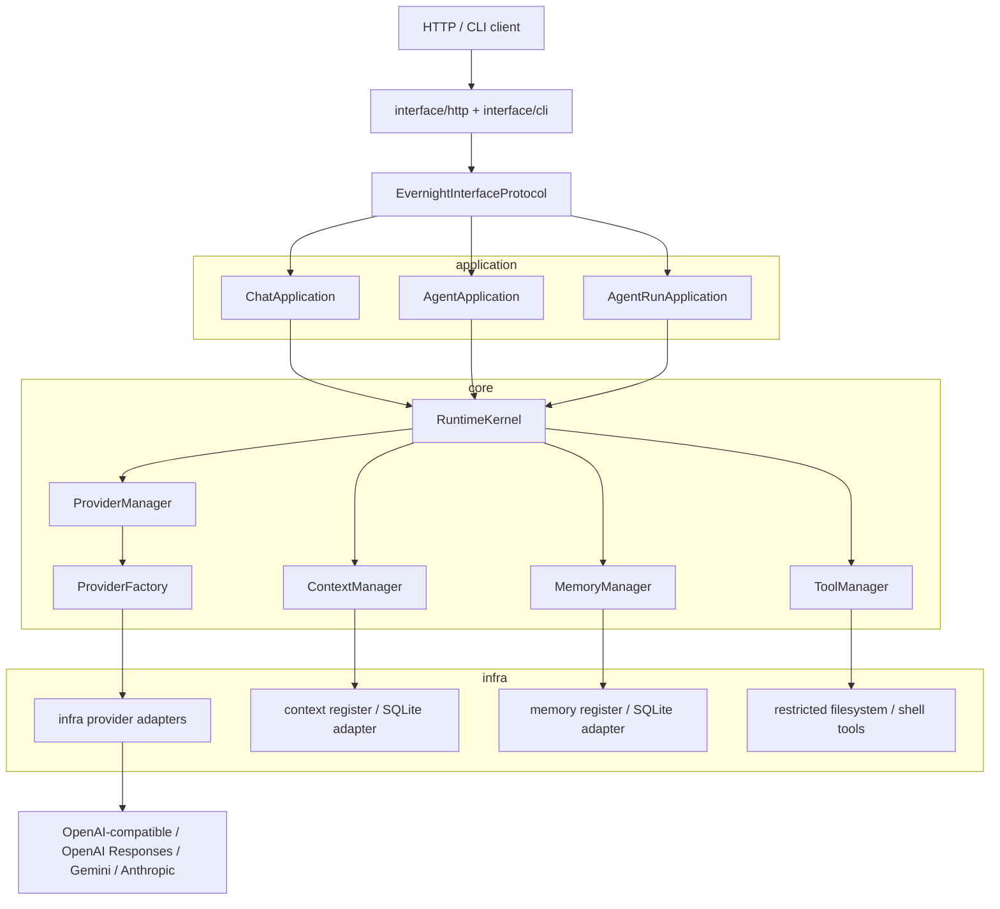

# EvernightAI

EvernightAI 是一个小型分层 AI runtime，用来组织聊天模型提供商、工具、
上下文、记忆和 agent run。

当前主链路是：

```text
RuntimeKernel -> ChatApplication -> ProviderManager -> provider adapter
-> real provider -> response mapper -> ChatResponse
```

## 架构

EvernightAI 的接口层刻意保持很薄。HTTP 和 CLI 不负责组装 runtime，不认识
SQLite、provider builder 或具体 infra adapter；它们只接收已经组装好的
interface/runtime，把外部请求翻译成 core schema，再调用协议边界。

应用层负责协调用例，核心层定义领域对象和协议，基础设施层负责具体适配器和
启动装配。



依赖方向是单向的：

```text
interface -> core protocols/schemas
application -> core protocols/schemas
infra -> core protocols/schemas
entrypoint/bootstrap -> application + infra + interface assembly
```

这意味着：

- `core` 不依赖 `application` 或 `infra`
- `application` 不依赖 `infra`
- `interface` 不负责组装 application service 或具体 runtime
- 具体 provider、SQLite、工具适配器都留在 `infra`
- HTTP/CLI 只做外部通信边界和 schema 转换

## 目录结构

```text
src/EvernightAI/core        领域模型、schema、协议、错误
src/EvernightAI/application 薄应用服务层
src/EvernightAI/infra       provider、SQLite、工具等具体适配器和 bootstrap
src/EvernightAI/interface   HTTP / CLI 外部通信边界
src/EvernightAI/entrypoint  HTTP / CLI 启动入口
tests                       单元、架构、HTTP/CLI、真实 provider opt-in 测试
```

## HTTP 能力

当前 HTTP 接口覆盖：

- provider 创建、模型查询、能力查询、删除
- context 创建、查询、替换、追加消息、删除
- memory 创建、查询、选择、删除
- tool 列表
- 直接 chat
- 带 context 的 chat
- SSE chat streaming
- 持久化 agent run
- 持久化 agent trace streaming
- agent run resume

## 项目规则

这些规则由测试保护。如果需要打破其中一条，应当同步更新规则和测试。

- `core` 不能依赖 `application` 或 `infra`
- `application` 不能依赖 `infra`
- `interface` 不能组装 application services 或具体 infra runtime
- package `__init__.py` 文件只保留注释
- OpenAI-compatible provider 不能被要求必须支持远程 `/models`
- `chat` 和 `chat_stream` 不能要求 `ProviderConfig.model` 预先声明模型
- context storage 是 core protocol/domain concern
- memory 和 context 保持分离
- provider 创建边界使用 `ProviderFactory` / `ProviderFactoryProtocol`
- 外部接口边界使用 `EvernightInterfaceProtocol`
- 真实 provider 测试默认跳过，必须显式 opt-in
- 真实 provider 不可用时应当 `pytest.skip`，不能作为本地集成测试失败
- pytest 输出中保留清晰的 skip reason

## 本地检查

```powershell
.\.venv\Scripts\python.exe -m pytest
.\.venv\Scripts\pyright.exe
```

## 启动 HTTP 接口

```powershell
$env:EVERNIGHTAI_DATABASE_PATH=".evernight\runtime.sqlite3"
$env:EVERNIGHTAI_FILESYSTEM_ROOT=(Get-Location).Path
.\.venv\Scripts\python.exe -m uvicorn EvernightAI.entrypoint.server:create_app --factory --reload
```

HTTP 启动模块是 package-level composition root。runtime 和服务装配应当留在
`entrypoint`、`application` 或 `infra bootstrap`，不要放进 `interface/http`。

## CLI

项目提供两个命令入口：

```text
evernight
evernight-http
```

常用命令：

```powershell
evernight config check
evernight config show
evernight provider list
evernight model list --provider main
evernight chat --provider main --model deepseek-chat "hello"
evernight serve
```

## 真实 Provider Smoke Test

真实 provider 测试默认禁用，只在显式设置环境变量时运行。

OpenAI-compatible:

```powershell
$env:EVERNIGHTAI_RUN_REAL_OPENAI="1"
$env:EVERNIGHTAI_REAL_OPENAI_API_KEY="your-key"
$env:EVERNIGHTAI_REAL_OPENAI_MODEL="deepseek-chat"
$env:EVERNIGHTAI_REAL_OPENAI_BASE_URL="https://your-openai-compatible-endpoint/v1"
.\.venv\Scripts\python.exe -m pytest tests\test_real_openai_flow.py -m real_openai
```

OpenAI Responses:

```powershell
$env:EVERNIGHTAI_RUN_REAL_OPENAI_RESPONSES="1"
$env:EVERNIGHTAI_REAL_OPENAI_RESPONSES_API_KEY="your-key"
$env:EVERNIGHTAI_REAL_OPENAI_RESPONSES_MODEL="gpt-4.1-mini"
.\.venv\Scripts\python.exe -m pytest tests\test_real_openai_responses_flow.py -m real_openai_responses
```

Gemini:

```powershell
$env:EVERNIGHTAI_RUN_REAL_GEMINI="1"
$env:EVERNIGHTAI_REAL_GEMINI_API_KEY="your-key"
$env:EVERNIGHTAI_REAL_GEMINI_MODEL="gemini-2.0-flash"
.\.venv\Scripts\python.exe -m pytest tests\test_real_gemini_flow.py -m real_gemini
```

Anthropic:

```powershell
$env:EVERNIGHTAI_RUN_REAL_ANTHROPIC="1"
$env:EVERNIGHTAI_REAL_ANTHROPIC_API_KEY="your-key"
$env:EVERNIGHTAI_REAL_ANTHROPIC_MODEL="claude-3-5-haiku-latest"
.\.venv\Scripts\python.exe -m pytest tests\test_real_anthropic_flow.py -m real_anthropic
```

各 provider 的 `BASE_URL` 可以按需设置。OpenAI-compatible 和 OpenAI
Responses 也支持 `OPENAI_API_KEY` / `OPENAI_BASE_URL` 作为 fallback；
Gemini 支持 `GOOGLE_API_KEY` fallback；Anthropic 支持 `ANTHROPIC_API_KEY`
fallback。
