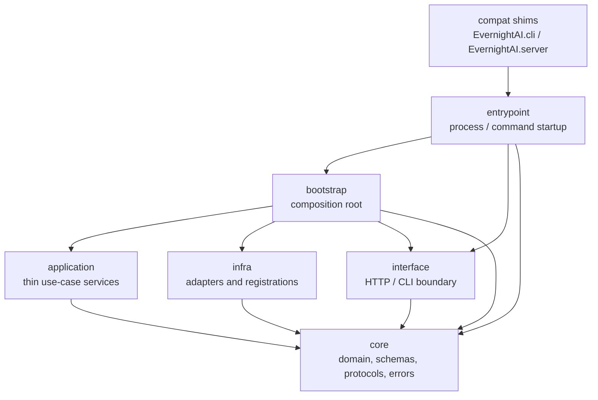
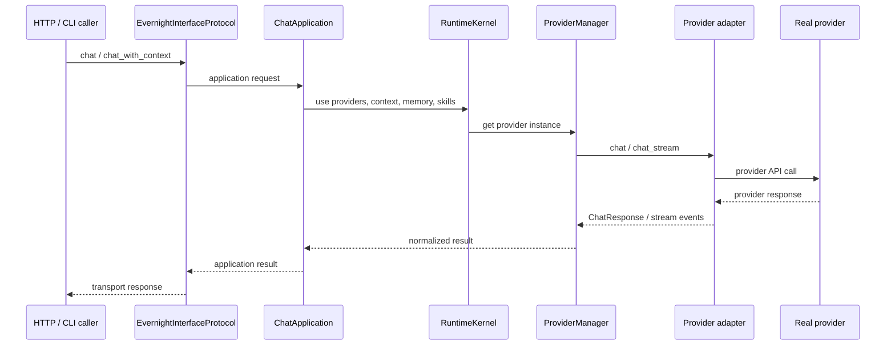
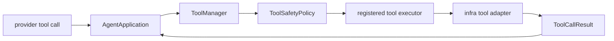

# EvernightAI Dependency Architecture

This document records the package dependency shape observed from Python imports
under `src/EvernightAI`.

## Layer Import Graph

The current internal import graph is:

```text
application -> core
interface   -> core
infra       -> core
bootstrap   -> application, core, infra, interface
entrypoint  -> bootstrap, core, interface
compat      -> entrypoint
```

`compat` means the package-level compatibility modules `EvernightAI.cli` and
`EvernightAI.server`.



## Composition Graph

`bootstrap` is the only layer that names concrete roles from multiple layers at
once. It assembles application services, concrete infra adapters, registrations,
runtime stores, and HTTP app factories.

```mermaid
flowchart TD
    subgraph Entrypoint["entrypoint"]
        CLIEntrypoint["cli.py"]
        ServerEntrypoint["server.py"]
    end

    subgraph Bootstrap["bootstrap"]
        BootConfig["config.py<br/>config -> runtime/interface"]
        BootRuntime["runtime.py<br/>RuntimeKernel assembly"]
        BootInterface["interface.py<br/>application service assembly"]
        BootHTTP["http.py<br/>FastAPI app factory"]
    end

    subgraph Core["core"]
        RuntimeKernel["RuntimeKernel"]
        ProviderManager["ProviderManager"]
        ToolManager["ToolManager"]
        ContextManager["ContextManager"]
        MemoryManager["MemoryManager"]
        SessionManager["SessionManager"]
        SkillManager["SkillManager"]
        InterfaceDomain["EvernightInterface"]
    end

    subgraph Application["application"]
        ChatApp["ChatApplication"]
        AgentApp["AgentApplication"]
        AgentRuns["AgentRunApplication"]
        ProviderApp["ProviderApplication"]
        ToolApp["ToolApplication"]
        SessionApp["SessionApplication"]
        SkillApp["SkillApplication"]
    end

    subgraph Infra["infra"]
        ProviderRegs["provider registrations"]
        ToolRegs["tool registrations"]
        SkillRegs["skill registrations"]
        SQLiteStores["SQLite stores"]
        ProviderAdapters["provider adapters"]
        ToolAdapters["tool adapters"]
    end

    subgraph Interface["interface"]
        HTTPApp["FastAPI routes"]
        CLICommands["CLI commands"]
    end

    CLIEntrypoint --> BootConfig
    CLIEntrypoint --> CLICommands
    ServerEntrypoint --> BootHTTP
    BootHTTP --> BootConfig
    BootHTTP --> HTTPApp

    BootConfig --> BootRuntime
    BootConfig --> BootInterface
    BootRuntime --> RuntimeKernel
    BootInterface --> InterfaceDomain

    RuntimeKernel --> ProviderManager
    RuntimeKernel --> ToolManager
    RuntimeKernel --> ContextManager
    RuntimeKernel --> MemoryManager
    RuntimeKernel --> SessionManager
    RuntimeKernel --> SkillManager

    BootRuntime --> ProviderRegs
    BootRuntime --> ToolRegs
    BootRuntime --> SkillRegs
    BootRuntime --> SQLiteStores
    ProviderRegs --> ProviderAdapters
    ToolRegs --> ToolAdapters

    BootInterface --> ChatApp
    BootInterface --> AgentApp
    BootInterface --> AgentRuns
    BootInterface --> ProviderApp
    BootInterface --> ToolApp
    BootInterface --> SessionApp
    BootInterface --> SkillApp

    InterfaceDomain --> ChatApp
    InterfaceDomain --> AgentApp
    InterfaceDomain --> AgentRuns
    InterfaceDomain --> ProviderApp
    InterfaceDomain --> ToolApp
    InterfaceDomain --> SessionApp
    InterfaceDomain --> SkillApp

    HTTPApp --> InterfaceDomain
    CLICommands --> InterfaceDomain
```



## Runtime Request Paths

### Chat Path



### Tool Path



## Dependency Rules Captured By Tests

- `core` does not import `application`, `infra`, `interface`, `bootstrap`, or
  `entrypoint`.
- `application` imports `core` only.
- `infra` imports `core` only, plus external libraries needed by concrete
  adapters.
- `interface` imports `core` and transport/config libraries, but not
  `application` or `infra`.
- `bootstrap` is the concrete assembly boundary and may import from
  `application`, `core`, `infra`, and `interface`.
- `entrypoint` launches commands/processes and delegates assembly to
  `bootstrap`.

## External Dependency Concentration

The import scan shows external dependencies concentrated by role:

- `interface`: FastAPI, JWT, Pydantic, logging/config parsing.
- `infra`: provider SDKs, HTTP client, SQLite, filesystem/process helpers.
- `core`: Pydantic schemas and standard-library domain utilities.
- `entrypoint`: argparse, uvicorn, process startup helpers.

This keeps framework and provider details outside the domain and application
coordination layers.
