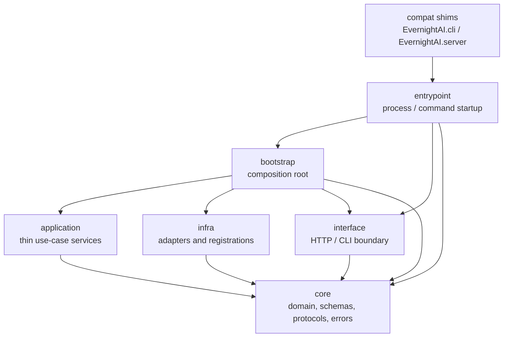
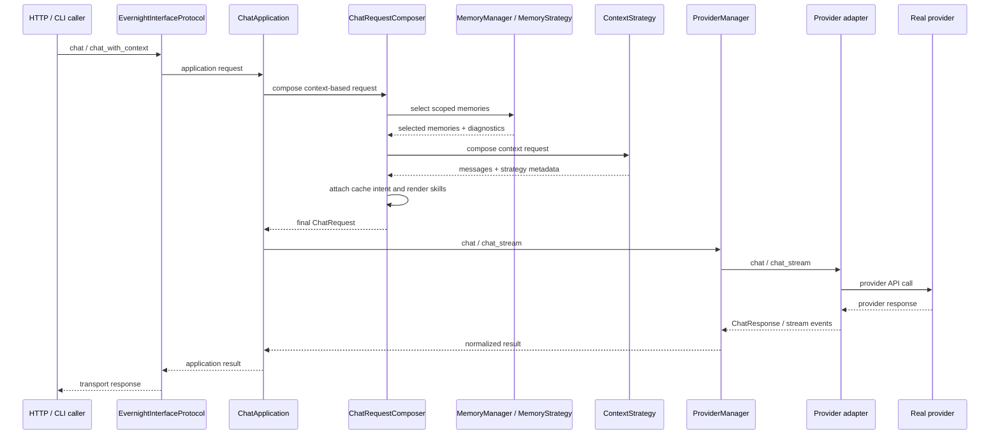
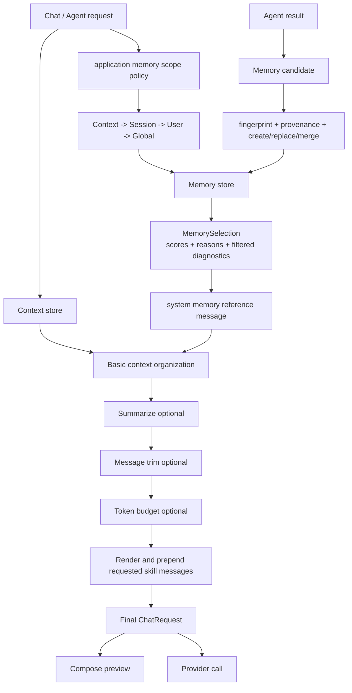
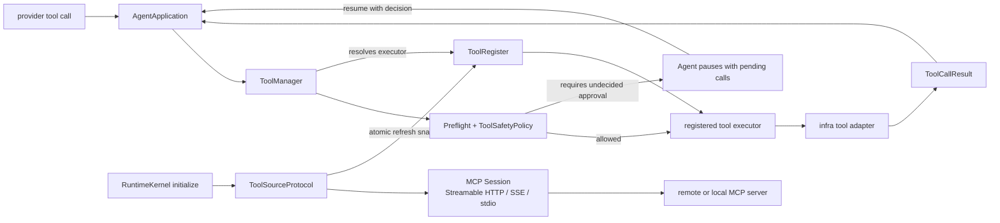

# EvernightAI Dependency Architecture

EvernightAI combines a layered Python backend with a Vue frontend. This document
describes source dependencies, concrete assembly, and runtime responsibilities.
The [architecture diagrams](architecture-diagrams.md) show request, permission,
deployment, frontend, and Agent lifecycle relationships.
The [project structure guide (Chinese)](project-structure.md) maps directories,
startup paths, feature locations, and a suggested reading order.

## Project Responsibilities

| Location | Responsibility |
| --- | --- |
| `src/EvernightAI/core` | Domain managers and strategies, protocols, schemas, and errors |
| `src/EvernightAI/application` | Chat, Agent, session, provider, and image use cases; request and memory composition |
| `src/EvernightAI/infra` | Provider, SQLite, tool, MCP, and sandbox adapters and registrations |
| `src/EvernightAI/interface` | HTTP and CLI transport, validation, authentication, and error mapping |
| `src/EvernightAI/bootstrap` | Concrete runtime, service, authorization, and HTTP app assembly |
| `src/EvernightAI/entrypoint` | Process startup and command dispatch |
| `frontend/src` | API transport, domain transformations, runtime coordination, XState machines, and Vue components |
| `tests` / `frontend/tests` | Backend behavior and architecture checks; frontend unit and browser checks |

`core` includes executable domain behavior such as provider management, tool
authorization, memory selection, and context strategies. Application services
coordinate these roles through core protocols. Agent execution and recovery are
application concerns; their concrete task executor and persistent stores are
infra concerns.

## Layer Import Graph

The current internal import graph is:

```text
application -> core
interface   -> core
infra       -> core
bootstrap   -> application, core, infra, interface
entrypoint  -> bootstrap, core, interface
compat      -> entrypoint
```

`compat` means the package-level compatibility modules `EvernightAI.cli` and
`EvernightAI.server`.


```mermaid
flowchart TD
    Compat["compat shims<br/>EvernightAI.cli / EvernightAI.server"]
    Entrypoint["entrypoint<br/>process / command startup"]
    Bootstrap["bootstrap<br/>composition root"]
    Interface["interface<br/>HTTP / CLI boundary"]
    Application["application<br/>thin use-case services"]
    Infra["infra<br/>adapters and registrations"]
    Core["core<br/>domain, schemas, protocols, errors"]

    Compat --> Entrypoint
    Entrypoint --> Bootstrap
    Entrypoint --> Interface
    Entrypoint --> Core

    Bootstrap --> Application
    Bootstrap --> Infra
    Bootstrap --> Interface
    Bootstrap --> Core

    Application --> Core
    Interface --> Core
    Infra --> Core
```

## Composition Graph

`bootstrap` is the only layer that names concrete roles from multiple layers at
once. It assembles application services, concrete infra adapters, registrations,
runtime stores, and HTTP app factories.


```mermaid
flowchart TD
    subgraph Entrypoint["entrypoint"]
        CLIEntrypoint["cli.py"]
        ServerEntrypoint["server.py"]
    end

    subgraph Bootstrap["bootstrap"]
        BootConfig["config.py<br/>config -> runtime/interface"]
        BootRuntime["runtime.py<br/>RuntimeKernel assembly"]
        BootInterface["interface.py<br/>application service assembly"]
        BootHTTP["http.py<br/>FastAPI app factory"]
    end

    subgraph Core["core"]
        RuntimeKernel["RuntimeKernel"]
        ProviderManager["ProviderManager"]
        ToolManager["ToolManager"]
        ContextManager["ContextManager"]
        MemoryManager["MemoryManager"]
        SessionManager["SessionManager"]
        SkillManager["SkillManager"]
        DataManager["DataAnalysisManager"]
        InterfaceDomain["EvernightInterface"]
    end

    subgraph Application["application"]
        ChatApp["ChatApplication"]
        AgentApp["AgentApplication"]
        AgentRuns["AgentRunApplication"]
        ProviderApp["ProviderApplication"]
        SessionApp["SessionApplication"]
    end

    subgraph Infra["infra"]
        ProviderRegs["provider registrations"]
        ToolRegs["tool registrations"]
        SkillRegs["skill registrations"]
        SQLiteStores["SQLite stores"]
        ProviderAdapters["provider adapters"]
        ToolAdapters["tool adapters"]
    end

    subgraph Interface["interface"]
        HTTPApp["FastAPI routes"]
        CLICommands["CLI commands"]
    end

    CLIEntrypoint --> BootConfig
    CLIEntrypoint --> CLICommands
    ServerEntrypoint --> BootHTTP
    BootHTTP --> BootConfig
    BootHTTP --> HTTPApp

    BootConfig --> BootRuntime
    BootConfig --> BootInterface
    BootRuntime --> RuntimeKernel
    BootInterface --> InterfaceDomain

    RuntimeKernel --> ProviderManager
    RuntimeKernel --> ToolManager
    RuntimeKernel --> ContextManager
    RuntimeKernel --> MemoryManager
    RuntimeKernel --> SessionManager
    RuntimeKernel --> SkillManager
    RuntimeKernel --> DataManager

    BootRuntime --> ProviderRegs
    BootRuntime --> ToolRegs
    BootRuntime --> SkillRegs
    BootRuntime --> SQLiteStores
    ProviderRegs --> ProviderAdapters
    ToolRegs --> ToolAdapters

    BootInterface --> ChatApp
    BootInterface --> AgentApp
    BootInterface --> AgentRuns
    BootInterface --> ProviderApp
    BootInterface --> SessionApp

    InterfaceDomain --> ChatApp
    InterfaceDomain --> AgentApp
    InterfaceDomain --> AgentRuns
    InterfaceDomain --> ProviderApp
    InterfaceDomain -- "data_analysis = runtime.data_analysis" --> DataManager
    InterfaceDomain -- "tools = runtime.tools" --> ToolManager
    InterfaceDomain --> SessionApp
    InterfaceDomain -- "skills = runtime.skills" --> SkillManager

    HTTPApp --> InterfaceDomain
    CLICommands --> InterfaceDomain
```

The assembly entry points are:

- [`bootstrap.config`](../src/EvernightAI/bootstrap/config.py): converts
  `EvernightConfig` into a runtime/interface and configures MCP sources, data
  sources, sandbox selection, and strategies.
- [`bootstrap.runtime`](../src/EvernightAI/bootstrap/runtime.py): creates domain
  managers, registers provider builders and tools, and supplies concrete stores.
  SQLite assembly runs migrations and reconciles interrupted Agent runs before
  creating the single-process Agent executor.
- [`bootstrap.interface`](../src/EvernightAI/bootstrap/interface.py): binds
  application services into `EvernightInterface`. Its tool role is the existing
  `runtime.tools` object implementing `ToolInterfaceProtocol`. Skill and
  data-analysis roles also use their existing runtime managers directly.
- [`bootstrap.http`](../src/EvernightAI/bootstrap/http.py): supplies the assembled
  interface, authentication devices, and lifecycle handlers to the HTTP app.

Skill and data-analysis operations use the managers' method names at the
interface boundary. Data analysis reuses `DataAnalysisManageProtocol`;
`SkillInterfaceProtocol` exposes template management, queries, and rendering
without exposing runtime restoration. Authorization wrappers enforce the same
permission actions before delegation. HTTP paths and operation IDs and CLI
commands retain their transport-specific names.

`RuntimeKernel.initialize()` restores persisted provider configurations and loads
configured tool sources. Interface shutdown drains Agent runs and closes the
runtime's sources, providers, stores, and sandbox.

## Runtime Request Paths

### Chat Path


```mermaid
sequenceDiagram
    participant Caller as HTTP / CLI caller
    participant Interface as EvernightInterfaceProtocol
    participant ChatApp as ChatApplication
    participant Composer as ChatRequestComposer
    participant Memory as MemoryManager / MemoryStrategy
    participant Context as ContextStrategy
    participant Providers as ProviderManager
    participant Adapter as Provider adapter
    participant Provider as Real provider

    Caller->>Interface: chat / chat_with_context
    Interface->>ChatApp: application request
    ChatApp->>Composer: compose context-based request
    Composer->>Memory: select scoped memories
    Memory-->>Composer: selected memories + diagnostics
    Composer->>Context: compose context request
    Context-->>Composer: messages + strategy metadata
    Composer->>Composer: attach cache intent and render skills
    Composer-->>ChatApp: final ChatRequest
    ChatApp->>Providers: chat / chat_stream
    Providers->>Adapter: chat / chat_stream
    Adapter->>Provider: provider API call
    Provider-->>Adapter: provider response
    Adapter-->>Providers: ChatResponse / stream events
    Providers-->>ChatApp: normalized result
    ChatApp-->>Interface: application result
    Interface-->>Caller: transport response
```

This path describes context-based chat. Direct `chat` accepts a `ChatRequest`
without loading a stored context. Provider creation goes through
`ProviderFactory`; adapters receive the requested model ID even if it has no
local model declaration. OpenAI-compatible calls do not require remote `/models`
discovery.

### Memory And Context Path


```mermaid
flowchart TD
    Request["Chat / Agent request"] --> ScopePolicy["application memory scope policy"]
    ScopePolicy --> ScopeOrder["Context -> Session -> User -> Global"]
    ScopeOrder --> MemoryStore["Memory store"]
    MemoryStore --> Selection["MemorySelection<br/>scores + reasons + filtered diagnostics"]
    Selection --> MemoryMessage["system memory reference message"]

    Request --> ContextStore["Context store"]
    ContextStore --> Basic["Basic context organization"]
    MemoryMessage --> Basic
    Basic --> Summary["Summarize optional"]
    Summary --> Trim["Message trim optional"]
    Trim --> Budget["Token budget optional"]
    Budget --> Skills["Render and prepend requested skill messages"]
    Skills --> Final["Final ChatRequest"]
    Final --> Preview["Compose preview"]
    Final --> Provider["Provider call"]

    AgentResult["Agent result"] --> Candidate["Memory candidate"]
    Candidate --> Governance["fingerprint + provenance + create/replace/merge"]
    Governance --> MemoryStore
```

Memory remains durable data and context remains the per-call attention window.
Core defines schemas and strategies; application owns the composition policy;
bootstrap wires concrete strategy chains from configuration.
`ChatRequestComposer` applies context strategies before rendering and prepending
skill messages. The configured context token budget therefore covers the
context-strategy output, not the skill messages added afterward.

### Tool Path


```mermaid
flowchart LR
    Model["provider tool call"] --> AgentApp["AgentApplication"]
    AgentApp --> ToolManager["ToolManager"]
    ToolManager --> Policy["Preflight + ToolSafetyPolicy"]
    Policy -- "allowed" --> Executor["registered tool executor"]
    Policy -- "requires undecided approval" --> Pause["Agent pauses with pending calls"]
    Pause -- "resume with decision" --> AgentApp
    Executor --> Adapter["infra tool adapter"]
    Runtime["RuntimeKernel initialize"] --> Source["ToolSourceProtocol"]
    Source --> McpAdapter["MCP Session<br/>Streamable HTTP / SSE / stdio"]
    McpAdapter --> Remote["remote or local MCP server"]
    Source -- "atomic refresh snapshot" --> Register["ToolRegister"]
    ToolManager -- "resolves executor" --> Register
    Register --> Executor
    Adapter --> Result["ToolCallResult"]
    Result --> AgentApp
```

## Persistent Agent Runs

[`agent.py`](../src/EvernightAI/application/agent.py) preserves the public service
imports. Its persistent start/resume methods delegate to `AgentRunApplication`,
so executor ownership, timeout, failure reporting and pause controls share the
same path as HTTP and CLI.

| Module | Responsibility |
| --- | --- |
| `agent_execution.py` | Model/tool loop, approvals, transcript and memory writes |
| `agent_runs.py` | Persistent execution, executor, streaming and operator controls |
| `agent_recovery.py` | Snapshot reconciliation, checkpoint safety and startup recovery |
| `agent_lifecycle.py` | Shared shutdown boundary and active-run tracking |
| `agent_state.py` | Resume-mode rules, failure classification, request metadata keys and usage aggregation |

Control state lives in typed fields on `AgentRunState`, defined in
`core/schema/agent.py`:

| Field | Meaning |
| --- | --- |
| `pause` | A stop at a checkpoint: its `cause`, `checkpoint`, and whether it is `resumable`. Absent while a run waits for tool approval |
| `pause_request` | A pending request to pause at the next checkpoint |
| `failure` | The error that ended the run |
| `cancel_reason` | Why the run was canceled |
| `history` | Where the run's messages sit in its context's history |

A paused run with a resumable `pause` continues from its checkpoint; one without
a `pause` continues from its pending tool approvals; one whose `pause` is not
resumable can only be retried or unblocked by operator resolution.

Snapshots written before these fields existed kept the same state under
`metadata["agent_runtime"]`. `AgentRunState` lifts that form into the typed
fields when it is loaded and drops it from `metadata`, so it is read but never
written.

| Role | Data or behavior |
| --- | --- |
| `AgentRunState` | Request, latest response, steps, remaining rounds, pending tools/approvals, and recovery metadata |
| `AgentTraceEvent` | Observable timeline, including text deltas, approvals, tool results, and control events |
| `ToolExecutionAttempt` | Execution status, replay policy, stable idempotency key, result, and operator resolution |
| `AgentRunExecutorProtocol` | Execution ownership, timeout, cancellation, and stream execution |

SQLite assembly uses `SingleProcessAgentRunExecutor` with persisted leases and
heartbeats. Startup recovery skips runs with an active lease; interrupted runs
are paused and unfinished started tools become `UNKNOWN`. Checkpoints and tool
replay policies determine whether the original run can resume. Unknown
non-replayable executions require operator resolution or an explicit run retry.
Retry allocates a new run ID, records its source, and clears previous approvals.

The snapshot remains authoritative. `applied_trace_sequence` identifies the
persisted trace already represented in it; recovery reconciles only a contiguous
tail, preserving chat/tool order, remaining rounds and per-call usage. Step event
IDs prevent duplicate application. Legacy snapshots use their saved trace or
ordered steps to locate the boundary. Missing retained events or an unalignable
legacy snapshot block resumption. Trace alone cannot establish that context or
memory writes committed. A snapshot with finalization steps blocks resumption
because those writes may have partially completed. A completed `RUN_STOPPED`
tail restores the terminal state directly rather than pausing and replaying it.

Agent streams carry core trace events; HTTP encodes them as SSE. Model text
streaming is selected by request metadata `stream = true`. With an executor
configured, a background producer keeps persisted execution running after the
stream consumer disconnects. Manual pause is observed at checkpoints in the
stream persistence path. Context transcript writes occur at the tool-loop's
completion/failure paths, while approval pauses retain progress in run state.
Terminal status is assigned only after transcript and memory writes complete;
write failures are persisted as `FAILED` with their error details. Context appends
are not transactional across the entire transcript, so a failure may leave
partially written context.

## Authorization And Ownership

HTTP authentication resolves a `Principal` from an API key, configured OAuth
bearer token, or JWT. Bootstrap supplies the factory for an
`AuthorizedEvernightInterface`; HTTP dependencies obtain that wrapper per
request. CLI assembly can bind the configured principal to the same boundary.
The wrapper checks operation permissions and passes `PrincipalScope` into
resource access. Domain managers and stores enforce resource ownership.

Tool execution has its own preflight and safety checks, with approval decisions
bound to tool calls. Concrete adapters enforce target restrictions, and configured
process tools use the assembled sandbox. Interface authorization, tool approval,
and process isolation have separate responsibilities.

## Frontend Architecture

The Vue 3 / TypeScript / Vite frontend has workspace (`index.html`) and chat
(`chat.html`) entries; image generation is a view of the chat page
(`chat.html#images`). Its main
responsibilities are:

| Directory | Responsibility |
| --- | --- |
| `api` | Shared JSON, SSE, and WebSocket transport, credentials, and API errors |
| `domain` | Workspace resource concepts and chat transcript/event transformations |
| `runtime` | API operation coordination, stream recovery, cancellation, and authentication changes |
| `state` | XState workspace and chat lifecycle machines |
| `components` | Views, interaction controls, and local presentation state |

The workspace machine exposes loading, ready, degraded, unauthorized, and
offline states. The chat machine manages session selection, Agent streaming,
approval, recovery, retry, and cancellation. Chat operations use persisted
`/agent-runs` and associated session/context APIs. Components subscribe to actors
and send lifecycle events; runtime functions execute the associated operations.
Authentication changes reset active chat/workspace state through the shared
workspace runtime.

The image entry also starts the shared workspace runtime. Image generation and
history components call the image APIs directly and maintain local request state.
Backend image routes use the provider interface role; `ProviderApplication`
delegates generation and history operations to `ImageApplication`, which uses
runtime providers, image storage, and archival adapters.

In development, Vite proxies backend API requests and WebSocket traffic. In a
configured deployment, FastAPI can serve `frontend/dist` alongside the API.
See the [frontend guide](../frontend/README.md) for state and component details.

## Source Map And Verification

- [Runtime roles](../src/EvernightAI/core/domain/runtime.py) and
  [interface contracts](../src/EvernightAI/core/protocol/interface.py).
- [Request composition](../src/EvernightAI/application/chat_request.py) and
  [Agent coordination](../src/EvernightAI/application/agent.py).
- [Architecture rules](../tests/test_architecture_rules.py) enforce import and
  composition boundaries.
- [Agent behavior tests](../tests/test_application_agent.py) check tool loops,
  approval side effects, checkpoint recovery, retry, and disconnected streams.
- [SQLite Agent tests](../tests/test_sqlite_agent_adapter.py) and
  [runtime foundation tests](../tests/test_sqlite_runtime_foundation.py) check
  persistence, leases, ownership, and startup recovery.
- Frontend state/runtime tests and browser checks are described in the
  [frontend guide](../frontend/README.md).

## Dependency Rules Captured By Tests

- `core` does not import `application`, `infra`, `interface`, `bootstrap`, or
  `entrypoint`.
- `application` imports `core` only.
- `infra` imports `core` only, plus external libraries needed by concrete
  adapters.
- `interface` imports `core` and transport/config libraries, but not
  `application` or `infra`.
- `bootstrap` is the concrete assembly boundary and may import from
  `application`, `core`, `infra`, and `interface`.
- `entrypoint` launches commands/processes and delegates assembly to
  `bootstrap`.

## External Dependency Concentration

The import scan shows external dependencies concentrated by role:

- `interface`: FastAPI, JWT, Pydantic, logging/config parsing.
- `infra`: provider SDKs, HTTP client, SQLite, filesystem/process helpers.
- `core`: Pydantic schemas and standard-library domain utilities.
- `entrypoint`: argparse, uvicorn, process startup helpers.

This keeps framework and provider details outside the domain and application
coordination layers.
