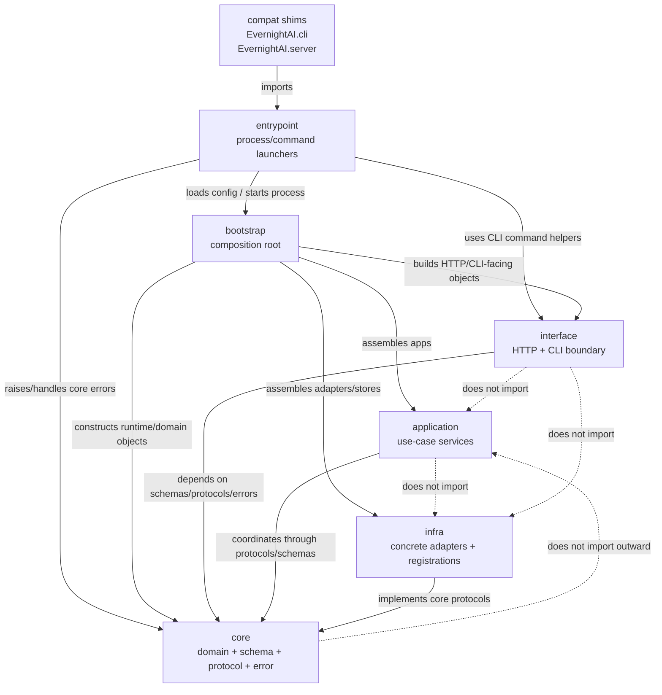
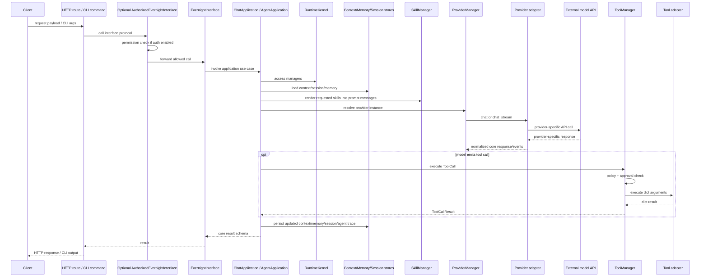
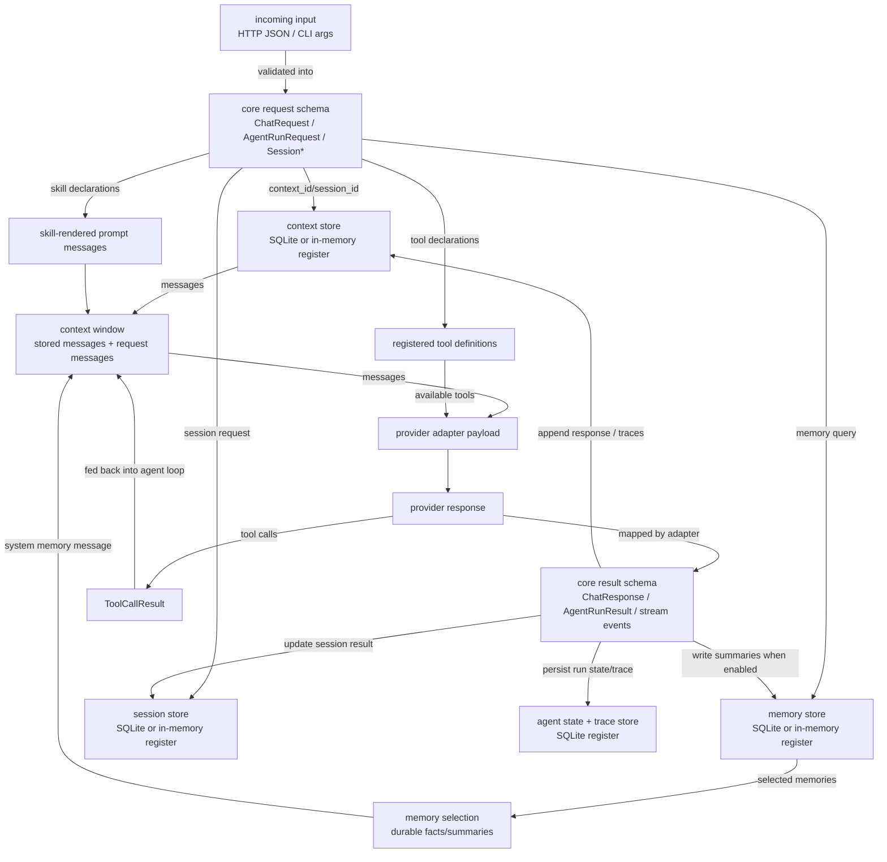
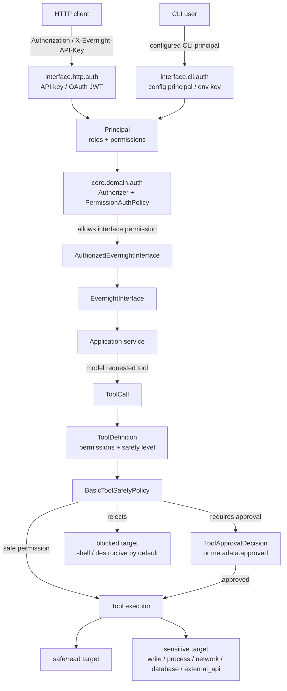
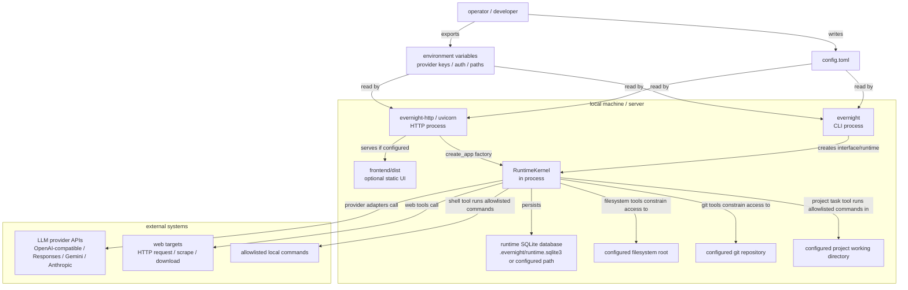

# EvernightAI Architecture Diagrams

This document contains six focused diagrams. Each diagram answers one question
and uses labeled arrows so the dependency or runtime relationship is explicit.

## 1. Source Dependency

Question: which package layers import which other package layers?

This is an import graph, not a runtime call graph.

Key point: `bootstrap` is the only normal layer that imports across all roles.
The inner operational layers converge on `core`.

## 2. Runtime Assembly

Question: what does `bootstrap.runtime` actually put into `RuntimeKernel`?

```mermaid
flowchart TD
    Config["EvernightConfig<br/>config.toml + environment"]
    RuntimeFactory["bootstrap.config<br/>create_runtime_from_config"]
    SQLiteRuntime["bootstrap.runtime<br/>create_sqlite_runtime"]

    Runtime["RuntimeKernel"]

    subgraph ProviderSide["provider side"]
        ProviderFactory["ProviderFactory"]
        ProviderManager["ProviderManager"]
        ProviderRegs["infra provider registrations<br/>openai / responses / gemini / anthropic"]
    end

    subgraph ToolSide["tool side"]
        ToolRegister["ToolRegister"]
        ToolManager["ToolManager"]
        ToolPolicy["BasicToolSafetyPolicy"]
        ToolRegs["infra tool registrations<br/>filesystem / shell / web / git / project / runtime_data"]
    end

    subgraph SkillSide["skill side"]
        SkillRegister["SkillRegister"]
        SkillManager["SkillManager"]
        EchoSkill["echo skill registration"]
    end

    subgraph StateSide["runtime state side"]
        ContextManager["ContextManager"]
        ContextStrategy["ContextOrganizer<br/>BasicContextStrategy"]
        MemoryManager["MemoryManager"]
        MemoryStrategy["BasicMemoryStrategy<br/>BasicMemoryWriteStrategy"]
        SessionManager["SessionManager"]
        AgentStores["Agent run state + trace registers"]
        SQLiteStores["SQLite adapters<br/>context / memory / session / agent"]
    end

    Config -- "tool/provider/db options" --> RuntimeFactory
    RuntimeFactory -- "delegates concrete assembly" --> SQLiteRuntime
    SQLiteRuntime -- "returns" --> Runtime

    SQLiteRuntime -- "registers provider builders" --> ProviderRegs
    ProviderRegs -- "builder functions" --> ProviderFactory
    ProviderFactory -- "owned by" --> Runtime
    ProviderManager -- "uses" --> ProviderFactory
    Runtime -- "owns" --> ProviderManager

    SQLiteRuntime -- "registers enabled tools" --> ToolRegs
    ToolRegs -- "tool definitions + executors" --> ToolRegister
    ToolRegister -- "owned by" --> Runtime
    ToolManager -- "uses" --> ToolRegister
    ToolManager -- "checks" --> ToolPolicy
    Runtime -- "owns" --> ToolManager

    SQLiteRuntime -- "registers builtin skills" --> EchoSkill
    EchoSkill --> SkillRegister
    SkillRegister -- "owned by" --> Runtime
    SkillManager -- "uses" --> SkillRegister
    Runtime -- "owns" --> SkillManager

    SQLiteRuntime -- "creates" --> SQLiteStores
    SQLiteStores -- "back" --> ContextManager
    SQLiteStores -- "back" --> MemoryManager
    SQLiteStores -- "back" --> SessionManager
    SQLiteStores -- "back" --> AgentStores
    Runtime -- "owns" --> ContextManager
    Runtime -- "owns" --> ContextStrategy
    Runtime -- "owns" --> MemoryManager
    Runtime -- "owns" --> MemoryStrategy
    Runtime -- "owns" --> SessionManager
    Runtime -- "owns" --> AgentStores
```

Key point: registrations provide builders/executors into core registries; the
runtime owns the resulting managers and strategies.

## 3. Request Call Chain

Question: what happens when a chat or agent request enters through HTTP or CLI?

Key point: HTTP and CLI translate transport details into interface calls; the
application layer coordinates the use case through runtime managers.

## 4. Data Flow

Question: where do request data, context, memory, skills, tools, provider
responses, and persistence meet?

Key point: context and memory are separate. Memory selects durable information;
context organizes the model-visible window.

## 5. Permission Boundary

Question: where are user/API permissions and tool-execution permissions checked?

Key point: interface authorization controls who may call EvernightAI operations;
tool safety controls whether a specific tool execution may touch sensitive
targets.

## 6. Deployment Relationship

Question: what runs as processes, and what external systems do those processes
talk to?

Key point: EvernightAI has no separate worker process in the current design.
HTTP and CLI each assemble an in-process runtime from config; SQLite and
external provider/tool targets sit outside the runtime boundary.
