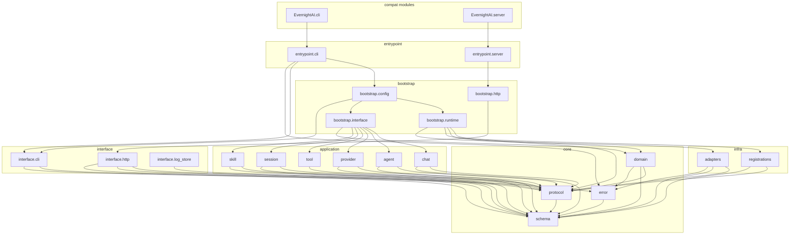
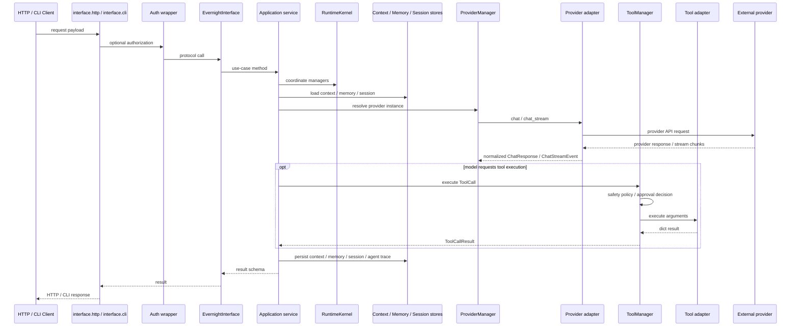
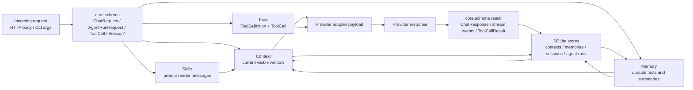
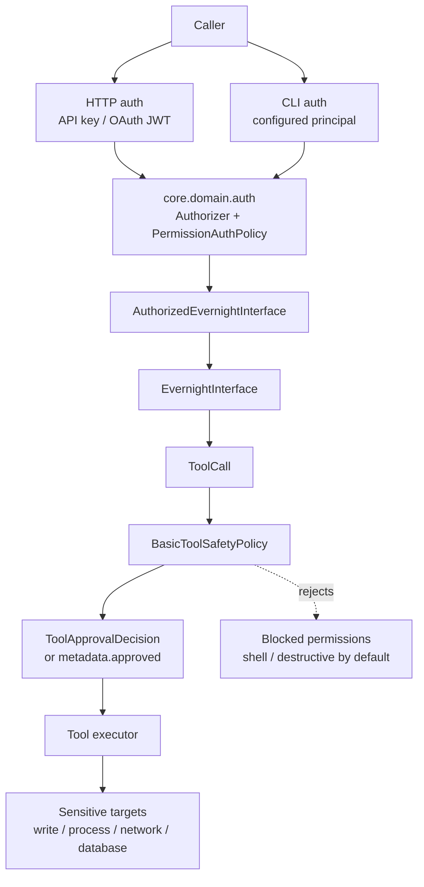
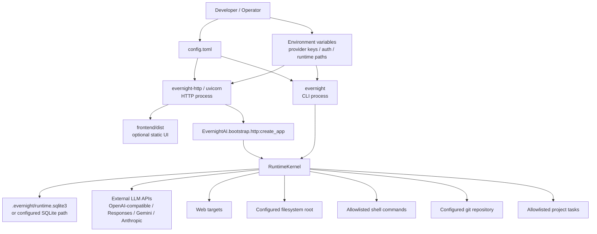

# EvernightAI Architecture Diagrams

This document captures six architecture views of the current EvernightAI codebase.

## 1. Source Dependency

## 2. Runtime Assembly

```mermaid
flowchart TD
    Config["EvernightConfig<br/>config.toml + env"]
    CreateRuntime["bootstrap.config<br/>create_runtime_from_config"]
    RuntimeAssembly["bootstrap.runtime<br/>create_sqlite_runtime"]
    InterfaceAssembly["bootstrap.interface<br/>create_interface"]
    HTTPAssembly["bootstrap.http<br/>create_app_from_config"]

    Runtime["RuntimeKernel"]

    ProviderFactory["ProviderFactory"]
    ProviderManager["ProviderManager"]
    ToolRegister["ToolRegister"]
    ToolManager["ToolManager"]
    ToolPolicy["BasicToolSafetyPolicy"]
    SkillRegister["SkillRegister"]
    SkillManager["SkillManager"]
    ContextManager["ContextManager"]
    ContextStrategy["ContextOrganizer + BasicContextStrategy"]
    MemoryManager["MemoryManager"]
    MemoryStrategy["BasicMemoryStrategy + BasicMemoryWriteStrategy"]
    SessionManager["SessionManager"]
    AgentState["Agent run state register"]
    AgentTrace["Agent trace register"]

    ProviderRegs["provider registrations<br/>openai / responses / gemini / anthropic"]
    ToolRegs["tool registrations<br/>filesystem / shell / web / git / project / runtime_data"]
    SkillRegs["skill registrations<br/>echo"]
    SQLiteRegs["SQLite registers<br/>context / memory / session / agent"]

    Interface["EvernightInterface"]
    Authorized["AuthorizedEvernightInterface<br/>optional auth wrapper"]
    HTTPApp["FastAPI app"]

    Config --> CreateRuntime
    Config --> HTTPAssembly
    CreateRuntime --> RuntimeAssembly
    RuntimeAssembly --> Runtime
    RuntimeAssembly --> ProviderRegs
    RuntimeAssembly --> ToolRegs
    RuntimeAssembly --> SkillRegs
    RuntimeAssembly --> SQLiteRegs

    Runtime --> ProviderFactory
    Runtime --> ProviderManager
    Runtime --> ToolRegister
    Runtime --> ToolManager
    Runtime --> ToolPolicy
    Runtime --> SkillRegister
    Runtime --> SkillManager
    Runtime --> ContextManager
    Runtime --> ContextStrategy
    Runtime --> MemoryManager
    Runtime --> MemoryStrategy
    Runtime --> SessionManager
    Runtime --> AgentState
    Runtime --> AgentTrace

    ProviderRegs --> ProviderFactory
    ToolRegs --> ToolRegister
    SkillRegs --> SkillRegister
    SQLiteRegs --> ContextManager
    SQLiteRegs --> MemoryManager
    SQLiteRegs --> SessionManager
    SQLiteRegs --> AgentState
    SQLiteRegs --> AgentTrace

    Runtime --> InterfaceAssembly
    InterfaceAssembly --> Interface
    InterfaceAssembly --> Authorized
    HTTPAssembly --> HTTPApp
    HTTPApp --> Interface
```

## 3. Request Call Chain

## 4. Data Flow

## 5. Permission Boundary

## 6. Deployment Relationship

