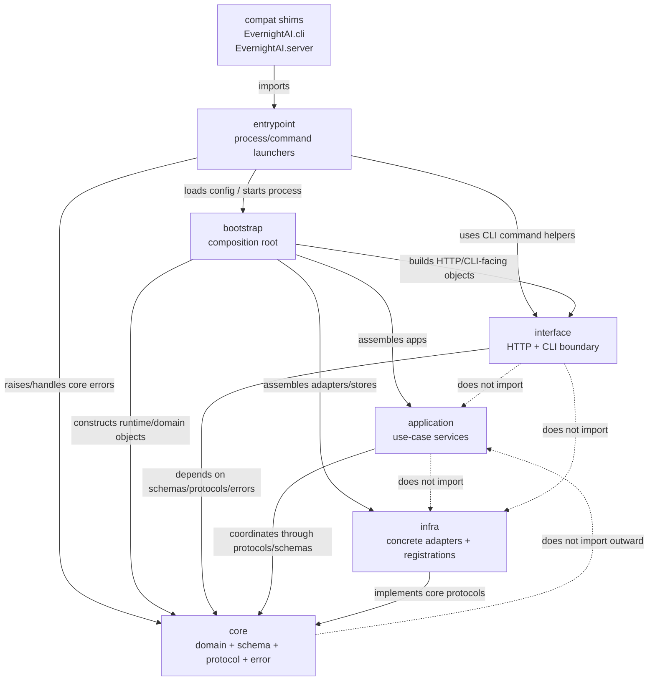
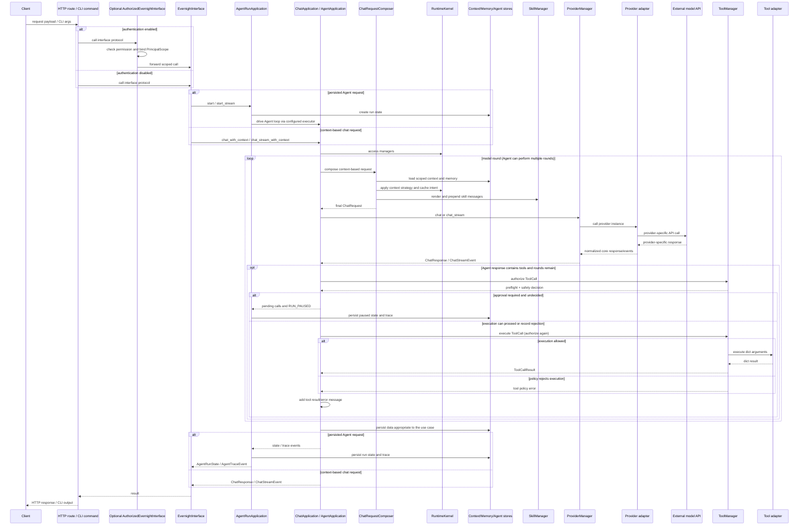
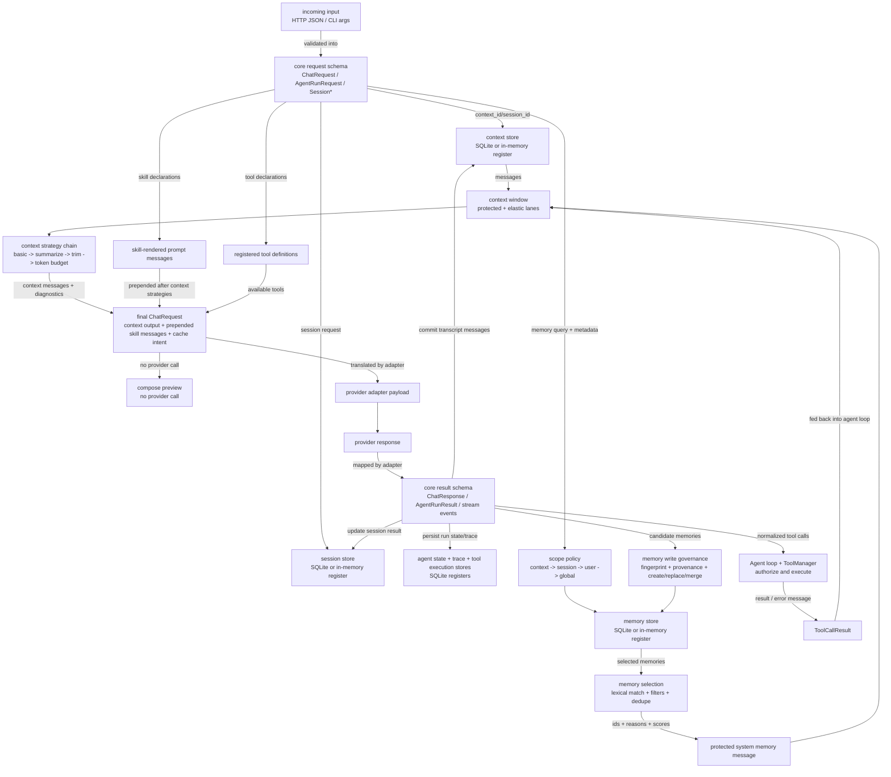
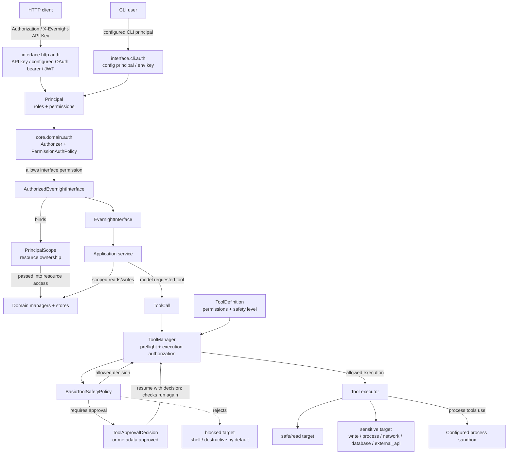
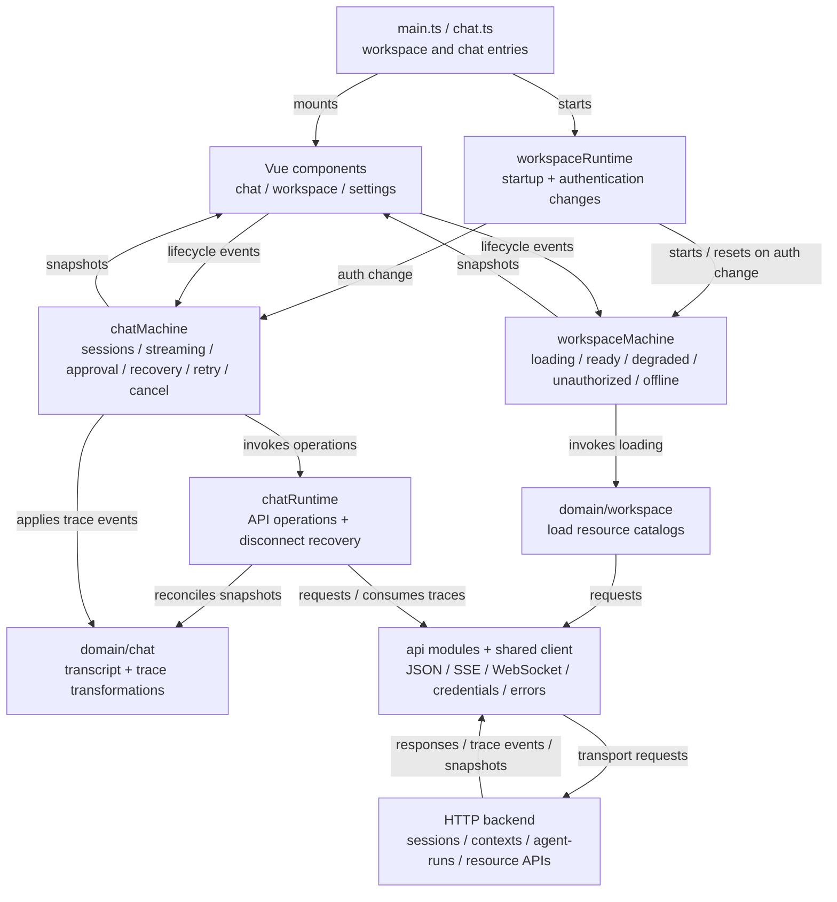
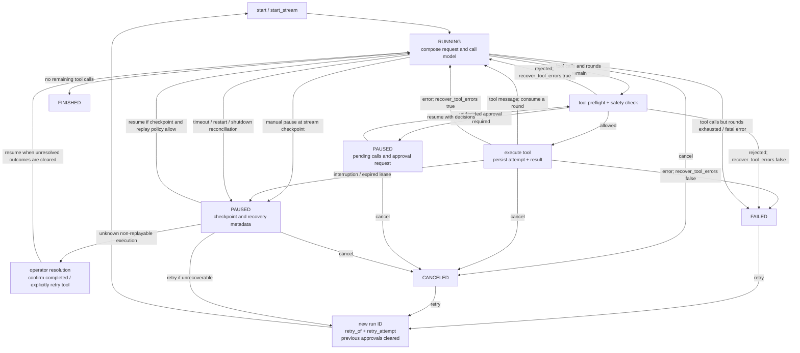

# EvernightAI Architecture Diagrams

This document contains eight focused diagrams. Each diagram answers one question
and uses labeled arrows so the dependency or runtime relationship is explicit.
See [dependency architecture](architecture-dependencies.md) for layer
responsibilities, assembly entry points, and source/test links.

## 1. Source Dependency

Question: which package layers import which other package layers?

This is an import graph, not a runtime call graph.

```mermaid
flowchart TD
    Compat["compat shims<br/>EvernightAI.cli<br/>EvernightAI.server"]
    Entrypoint["entrypoint<br/>process/command launchers"]
    Bootstrap["bootstrap<br/>composition root"]
    Interface["interface<br/>HTTP + CLI boundary"]
    Application["application<br/>use-case services"]
    Infra["infra<br/>concrete adapters + registrations"]
    Core["core<br/>domain + schema + protocol + error"]

    Compat -- "imports" --> Entrypoint

    Entrypoint -- "loads config / starts process" --> Bootstrap
    Entrypoint -- "uses CLI command helpers" --> Interface
    Entrypoint -- "raises/handles core errors" --> Core

    Bootstrap -- "assembles apps" --> Application
    Bootstrap -- "assembles adapters/stores" --> Infra
    Bootstrap -- "builds HTTP/CLI-facing objects" --> Interface
    Bootstrap -- "constructs runtime/domain objects" --> Core

    Interface -- "depends on schemas/protocols/errors" --> Core
    Application -- "coordinates through protocols/schemas" --> Core
    Infra -- "implements core protocols" --> Core

    Application -. "does not import" .-> Infra
    Interface -. "does not import" .-> Application
    Interface -. "does not import" .-> Infra
    Core -. "does not import outward" .-> Application
```

Key point: `bootstrap` is the only normal layer that imports across all roles.
The inner operational layers converge on `core`.

## 2. Runtime Assembly

Question: what does `bootstrap.runtime` actually put into `RuntimeKernel`?

```mermaid
flowchart TD
    Config["EvernightConfig<br/>config.toml + environment"]
    RuntimeFactory["bootstrap.config<br/>create_runtime_from_config"]
    SQLiteRuntime["bootstrap.runtime<br/>create_sqlite_runtime"]

    Runtime["RuntimeKernel"]

    subgraph ProviderSide["provider side"]
        ProviderFactory["ProviderFactory"]
        ProviderManager["ProviderManager"]
        ProviderRegs["infra provider registrations<br/>openai / responses / gemini / anthropic"]
    end

    subgraph ToolSide["tool side"]
        ToolRegister["ToolRegister"]
        ToolManager["ToolManager"]
        ToolPolicy["BasicToolSafetyPolicy"]
        ToolRegs["infra tool registrations<br/>filesystem / shell / web / git / project / runtime_data"]
        McpSources["MCP ToolSource adapters<br/>Streamable HTTP / SSE / stdio"]
        RemoteMcp["remote or local MCP servers"]
    end

    subgraph SkillSide["skill side"]
        SkillRegister["SkillRegister"]
        SkillManager["SkillManager"]
        EchoSkill["echo skill registration"]
    end

    subgraph StateSide["runtime state side"]
        ContextManager["ContextManager"]
        ContextStrategy["ContextOrganizer + context strategies<br/>basic / optional summary, trim, token budget"]
        MemoryManager["MemoryManager"]
        MemoryStrategy["BasicMemoryStrategy<br/>BasicMemoryWriteStrategy"]
        SessionManager["SessionManager"]
        AgentStores["Agent state + trace + tool execution registers"]
        AgentExecutor["SingleProcessAgentRunExecutor<br/>lease / heartbeat / timeout / cancel"]
        ProviderStore["ProviderConfigStore"]
        SQLiteStores["SQLite adapters<br/>context / memory / session / agent / providers"]
    end

    subgraph DataSide["data analysis side"]
        DataManager["DataAnalysisManager + register"]
        DataSources["SQLite runtime and configured data sources"]
    end

    Sandbox["SandboxExecuteProtocol<br/>subprocess / bubblewrap"]

    Config -- "tool/provider/db options" --> RuntimeFactory
    RuntimeFactory -- "delegates concrete assembly" --> SQLiteRuntime
    SQLiteRuntime -- "returns" --> Runtime

    SQLiteRuntime -- "registers provider builders" --> ProviderRegs
    ProviderRegs -- "builder functions" --> ProviderFactory
    ProviderFactory -- "owned by" --> Runtime
    ProviderManager -- "uses" --> ProviderFactory
    Runtime -- "owns" --> ProviderManager

    SQLiteRuntime -- "registers enabled tools" --> ToolRegs
    ToolRegs -- "tool definitions + executors" --> ToolRegister
    RuntimeFactory -- "creates configured sources" --> McpSources
    Runtime -- "initialize / close" --> McpSources
    McpSources -- "tools/list + tools/call + list_changed" --> RemoteMcp
    McpSources -- "atomic source snapshot" --> ToolRegister
    ToolRegister -- "owned by" --> Runtime
    ToolManager -- "uses" --> ToolRegister
    ToolManager -- "checks" --> ToolPolicy
    Runtime -- "owns" --> ToolManager
    RuntimeFactory -- "selects" --> Sandbox
    SQLiteRuntime -- "supplies to process tools" --> Sandbox
    Runtime -- "owns" --> Sandbox

    SQLiteRuntime -- "registers builtin skills" --> EchoSkill
    EchoSkill --> SkillRegister
    SkillRegister -- "owned by" --> Runtime
    SkillManager -- "uses" --> SkillRegister
    Runtime -- "owns" --> SkillManager

    SQLiteRuntime -- "creates" --> SQLiteStores
    SQLiteStores -- "back" --> ContextManager
    SQLiteStores -- "back" --> MemoryManager
    SQLiteStores -- "back" --> SessionManager
    SQLiteStores -- "back" --> AgentStores
    SQLiteStores -- "back" --> ProviderStore
    SQLiteRuntime -- "recovers interrupted runs and creates" --> AgentExecutor
    AgentExecutor -- "leases and heartbeats" --> AgentStores
    SQLiteRuntime -- "registers runtime sources" --> DataSources
    RuntimeFactory -- "registers configured sources" --> DataSources
    DataSources -- "definitions + statistics executors" --> DataManager
    Runtime -- "owns" --> DataManager
    Runtime -- "owns" --> ContextManager
    Runtime -- "owns" --> ContextStrategy
    Runtime -- "owns" --> MemoryManager
    Runtime -- "owns" --> MemoryStrategy
    Runtime -- "owns" --> SessionManager
    Runtime -- "owns" --> AgentStores
    Runtime -- "owns" --> AgentExecutor
    Runtime -- "owns" --> ProviderStore
```

Key point: registrations provide builders/executors into core registries; the
runtime owns the resulting managers and strategies.
`bootstrap.interface` binds application services to these roles. The interface's
tool role is `runtime.tools`; data analysis uses `DataAnalysisApplication`.
Runtime initialization restores providers and loads MCP sources. SQLite Agent
storage and its executor are supplied when Agent storage is enabled.

## 3. Request Call Chain

Question: what happens when a chat or agent request enters through HTTP or CLI?

```mermaid
sequenceDiagram
    participant Client as Client
    participant Route as HTTP route / CLI command
    participant Auth as Optional AuthorizedEvernightInterface
    participant Interface as EvernightInterface
    participant Runs as AgentRunApplication
    participant App as ChatApplication / AgentApplication
    participant Composer as ChatRequestComposer
    participant Runtime as RuntimeKernel
    participant Stores as Context/Memory/Agent stores
    participant Skills as SkillManager
    participant Providers as ProviderManager
    participant Adapter as Provider adapter
    participant LLM as External model API
    participant Tools as ToolManager
    participant ToolAdapter as Tool adapter

    Client->>Route: request payload / CLI args
    alt authentication enabled
        Route->>Auth: call interface protocol
        Auth->>Auth: check permission and bind PrincipalScope
        Auth->>Interface: forward scoped call
    else authentication disabled
        Route->>Interface: call interface protocol
    end
    alt persisted Agent request
        Interface->>Runs: start / start_stream
        Runs->>Stores: create run state
        Runs->>App: drive Agent loop via configured executor
    else context-based chat request
        Interface->>App: chat_with_context / chat_stream_with_context
    end

    App->>Runtime: access managers
    loop model round (Agent can perform multiple rounds)
        App->>Composer: compose context-based request
        Composer->>Stores: load scoped context and memory
        Composer->>Runtime: apply context strategy and cache intent
        Composer->>Skills: render and prepend skill messages
        Composer-->>App: final ChatRequest
        App->>Providers: chat or chat_stream
        Providers->>Adapter: call provider instance
        Adapter->>LLM: provider-specific API call
        LLM-->>Adapter: provider-specific response
        Adapter-->>Providers: normalized core response/events
        Providers-->>App: ChatResponse / ChatStreamEvent

        opt Agent response contains tools and rounds remain
            App->>Tools: authorize ToolCall
            Tools-->>App: preflight + safety decision
            alt approval required and undecided
                App-->>Runs: pending calls and RUN_PAUSED
                Runs->>Stores: persist paused state and trace
            else execution can proceed or record rejection
                App->>Tools: execute ToolCall (authorize again)
                alt execution allowed
                    Tools->>ToolAdapter: execute dict arguments
                    ToolAdapter-->>Tools: dict result
                    Tools-->>App: ToolCallResult
                else policy rejects execution
                    Tools-->>App: tool policy error
                end
                App->>App: add tool result/error message
            end
        end
    end

    App->>Stores: persist data appropriate to the use case
    alt persisted Agent request
        App-->>Runs: state / trace events
        Runs->>Stores: persist run state and trace
        Runs-->>Interface: AgentRunState / AgentTraceEvent
    else context-based chat request
        App-->>Interface: ChatResponse / ChatStreamEvent
    end
    Interface-->>Route: result
    Route-->>Client: HTTP response / CLI output
```

Key point: HTTP and CLI translate transport details into interface calls; the
application layer coordinates the use case through runtime managers.
The model-round participant groups shared `ChatApplication` and
`AgentApplication` work; `AgentRunApplication` manages persisted Agent execution.
Approval pauses return before the next round. Direct chat can use an incoming
`ChatRequest` without stored-context composition. Agent context transcripts are
committed at loop completion/failure, while persistent state and trace are saved
as execution progresses.

## 4. Data Flow

Question: where do request data, context, memory, skills, tools, provider
responses, and persistence meet?

```mermaid
flowchart TD
    Input["incoming input<br/>HTTP JSON / CLI args"]
    RequestSchema["core request schema<br/>ChatRequest / AgentRunRequest / Session*"]

    ContextStore["context store<br/>SQLite or in-memory register"]
    MemoryStore["memory store<br/>SQLite or in-memory register"]
    SessionStore["session store<br/>SQLite or in-memory register"]
    AgentStore["agent state + trace + tool execution stores<br/>SQLite registers"]

    ScopePolicy["scope policy<br/>context -> session -> user -> global"]
    MemorySelection["memory selection<br/>lexical match + filters + dedupe"]
    MemoryMessage["protected system memory message"]
    ContextWindow["context window<br/>protected + elastic lanes"]
    Preview["compose preview<br/>no provider call"]
    SkillMessages["skill-rendered prompt messages"]
    FinalRequest["final ChatRequest<br/>context output + prepended skill messages + cache intent"]
    ToolDefinitions["registered tool definitions"]

    ContextStrategy["context strategy chain<br/>basic -> summarize -> trim -> token budget"]
    ProviderPayload["provider adapter payload"]
    ProviderResponse["provider response"]
    CoreResult["core result schema<br/>ChatResponse / AgentRunResult / stream events"]
    ToolExecution["Agent loop + ToolManager<br/>authorize and execute"]
    ToolResults["ToolCallResult"]
    MemoryGovernance["memory write governance<br/>fingerprint + provenance + create/replace/merge"]

    Input -- "validated into" --> RequestSchema

    RequestSchema -- "context_id/session_id" --> ContextStore
    RequestSchema -- "memory query + metadata" --> ScopePolicy
    ScopePolicy --> MemoryStore
    RequestSchema -- "session request" --> SessionStore

    ContextStore -- "messages" --> ContextWindow
    MemoryStore -- "selected memories" --> MemorySelection
    MemorySelection -- "ids + reasons + scores" --> MemoryMessage
    MemoryMessage --> ContextWindow
    RequestSchema -- "skill declarations" --> SkillMessages
    RequestSchema -- "tool declarations" --> ToolDefinitions

    ContextWindow --> ContextStrategy
    ContextStrategy -- "context messages + diagnostics" --> FinalRequest
    SkillMessages -- "prepended after context strategies" --> FinalRequest
    ToolDefinitions -- "available tools" --> FinalRequest
    FinalRequest -- "no provider call" --> Preview
    FinalRequest -- "translated by adapter" --> ProviderPayload
    ProviderPayload --> ProviderResponse
    ProviderResponse -- "mapped by adapter" --> CoreResult

    CoreResult -- "normalized tool calls" --> ToolExecution
    ToolExecution -- "result / error message" --> ToolResults
    ToolResults -- "fed back into agent loop" --> ContextWindow

    CoreResult -- "commit transcript messages" --> ContextStore
    CoreResult -- "candidate memories" --> MemoryGovernance
    MemoryGovernance --> MemoryStore
    CoreResult -- "update session result" --> SessionStore
    CoreResult -- "persist run state/trace" --> AgentStore
```

Key point: context and memory are separate. Memory selects durable information
with observable reasons and scores; context organizes the model-visible window.
`ChatRequestComposer` supplies selected memory to the context strategy, which
organizes it into the protected system area before optional summary, trimming,
or token budgeting. Skill messages are rendered and prepended after that chain;
the configured context budget does not cover these later messages. Compose
preview stops at the final `ChatRequest` and never calls a provider. Session
updates occur in session use cases; Agent trace events go to the Agent trace
store rather than the context message history.

## 5. Permission Boundary

Question: where are user/API permissions and tool-execution permissions checked?

```mermaid
flowchart TD
    HTTPClient["HTTP client"]
    CLIUser["CLI user"]

    HTTPAuth["interface.http.auth<br/>API key / configured OAuth bearer / JWT"]
    CLIAuth["interface.cli.auth<br/>config principal / env key"]
    Principal["Principal<br/>roles + permissions"]
    Authorizer["core.domain.auth<br/>Authorizer + PermissionAuthPolicy"]
    AuthorizedInterface["AuthorizedEvernightInterface"]
    Scope["PrincipalScope<br/>resource ownership"]
    Stores["Domain managers + stores"]
    Interface["EvernightInterface"]

    App["Application service"]
    ToolCall["ToolCall"]
    ToolDefinition["ToolDefinition<br/>permissions + safety level"]
    ToolPolicy["BasicToolSafetyPolicy"]
    ToolManager["ToolManager<br/>preflight + execution authorization"]
    Approval["ToolApprovalDecision<br/>or metadata.approved"]
    Executor["Tool executor"]
    Sandbox["Configured process sandbox"]

    SafeTarget["safe/read target"]
    SensitiveTarget["sensitive target<br/>write / process / network / database / external_api"]
    BlockedTarget["blocked target<br/>shell / destructive by default"]

    HTTPClient -- "Authorization / X-Evernight-API-Key" --> HTTPAuth
    CLIUser -- "configured CLI principal" --> CLIAuth
    HTTPAuth --> Principal
    CLIAuth --> Principal
    Principal --> Authorizer
    Authorizer -- "allows interface permission" --> AuthorizedInterface
    AuthorizedInterface --> Interface
    AuthorizedInterface -- "binds" --> Scope
    Scope -- "passed into resource access" --> Stores
    Interface --> App
    App -- "scoped reads/writes" --> Stores

    App -- "model requested tool" --> ToolCall
    ToolCall --> ToolManager
    ToolDefinition --> ToolManager
    ToolManager --> ToolPolicy

    ToolPolicy -- "allowed decision" --> ToolManager
    ToolPolicy -- "requires approval" --> Approval
    Approval -- "resume with decision; checks run again" --> ToolManager
    ToolManager -- "allowed execution" --> Executor
    ToolPolicy -. "rejects" .-> BlockedTarget

    Executor --> SafeTarget
    Executor --> SensitiveTarget
    Executor -- "process tools use" --> Sandbox
```

Key point: interface authorization controls who may call EvernightAI operations;
tool safety controls whether a specific tool execution may touch sensitive
targets.
Concrete adapters also constrain paths, commands, network targets, and output.
Tool approval does not override a blocked permission or failed preflight check.

## 6. Deployment Relationship

Question: what runs as processes, and what external systems do those processes
talk to?

```mermaid
flowchart TD
    Operator["operator / developer"]
    Config["config.toml"]
    Env["environment variables<br/>provider keys / auth / paths"]

    subgraph LocalMachine["local machine / server"]
        CLIProcess["evernight<br/>CLI process"]
        HTTPProcess["evernight-http / uvicorn<br/>HTTP process"]
        StaticUI["frontend/dist<br/>optional static UI"]
        CLIRuntime["CLI RuntimeKernel<br/>in CLI process"]
        HTTPRuntime["HTTP RuntimeKernel<br/>in HTTP process"]
        Vite["Vite dev server<br/>development only"]
        SQLite["runtime SQLite database<br/>.evernight/runtime.sqlite3 or configured path"]
        FSRoot["configured filesystem root"]
        GitRepo["configured git repository"]
        ProjectRoots["configured project directories"]
        ShellCommands["allowlisted local commands<br/>subprocess / sandbox"]
        StdioMcp["local MCP server<br/>stdio child process"]
    end

    subgraph External["external systems"]
        Providers["LLM provider APIs<br/>OpenAI-compatible / Responses / Gemini / Anthropic"]
        WebTargets["web targets<br/>HTTP request / scrape / download"]
        RemoteMcp["remote MCP servers<br/>Streamable HTTP / SSE"]
    end

    Browser["browser<br/>Vue application"]

    Operator -- "writes" --> Config
    Operator -- "exports" --> Env
    Config -- "read by" --> CLIProcess
    Config -- "read by" --> HTTPProcess
    Env -- "read by" --> CLIProcess
    Env -- "read by" --> HTTPProcess

    CLIProcess -- "bootstrap creates interface/runtime" --> CLIRuntime
    HTTPProcess -- "bootstrap creates app/interface/runtime" --> HTTPRuntime
    HTTPProcess -- "serves if configured" --> StaticUI
    StaticUI -- "loads application assets" --> Browser
    Vite -- "serves assets in development" --> Browser
    Browser -- "JSON / SSE / WebSocket in deployment" --> HTTPProcess
    Browser -- "proxied API / WebSocket in development" --> Vite
    Vite -- "API / WebSocket proxy" --> HTTPProcess

    CLIRuntime -- "persists" --> SQLite
    HTTPRuntime -- "persists" --> SQLite
    CLIRuntime -- "provider adapters call" --> Providers
    HTTPRuntime -- "provider adapters call" --> Providers
    CLIRuntime -- "uses configured adapters" --> Targets["configured tool targets"]
    HTTPRuntime -- "uses configured adapters" --> Targets
    Targets -- "web tools call" --> WebTargets
    Targets -- "filesystem tools constrain access to" --> FSRoot
    Targets -- "filesystem tools select named roots" --> ProjectRoots
    Targets -- "git tools constrain access to" --> GitRepo
    Targets -- "project task commands run in" --> ProjectRoots
    Targets -- "shell tools execute" --> ShellCommands
    Targets -- "MCP stdio launches" --> StdioMcp
    Targets -- "MCP clients call" --> RemoteMcp
```

Key point: EvernightAI has no separate Agent worker service in the current design.
HTTP and CLI each assemble an in-process runtime from config; SQLite and
external provider/tool targets sit outside the runtime boundary.
The two runtimes are separate objects and may share the configured SQLite path.
Agent tasks run inside their owning process using `SingleProcessAgentRunExecutor`;
leases and heartbeats are persisted in SQLite. Enabled tools can launch command
or MCP subprocesses. The Vue application runs in the browser; Vite supplies
development assets and proxies API traffic, while deployed static assets can be
served by the HTTP app.

## 7. Frontend State And Transport

Question: how do browser views, lifecycle machines, API operations, and backend
events work together?

```mermaid
flowchart TD
    Entries["main.ts / chat.ts<br/>workspace and chat entries"]
    WorkspaceRuntime["workspaceRuntime<br/>startup + authentication changes"]
    WorkspaceMachine["workspaceMachine<br/>loading / ready / degraded / unauthorized / offline"]
    ChatMachine["chatMachine<br/>sessions / streaming / approval / recovery / retry / cancel"]
    Views["Vue components<br/>chat / workspace / settings"]
    ChatRuntime["chatRuntime<br/>API operations + disconnect recovery"]
    WorkspaceDomain["domain/workspace<br/>load resource catalogs"]
    ChatDomain["domain/chat<br/>transcript + trace transformations"]
    API["api modules + shared client<br/>JSON / SSE / WebSocket / credentials / errors"]
    Backend["HTTP backend<br/>sessions / contexts / agent-runs / resource APIs"]

    Entries -- "mounts" --> Views
    Entries -- "starts" --> WorkspaceRuntime
    WorkspaceRuntime -- "starts / resets on auth change" --> WorkspaceMachine
    WorkspaceRuntime -- "auth change" --> ChatMachine
    Views -- "lifecycle events" --> WorkspaceMachine
    Views -- "lifecycle events" --> ChatMachine
    WorkspaceMachine -- "snapshots" --> Views
    ChatMachine -- "snapshots" --> Views
    WorkspaceMachine -- "invokes loading" --> WorkspaceDomain
    WorkspaceDomain -- "requests" --> API
    ChatMachine -- "invokes operations" --> ChatRuntime
    ChatRuntime -- "requests / consumes traces" --> API
    ChatRuntime -- "reconciles snapshots" --> ChatDomain
    ChatMachine -- "applies trace events" --> ChatDomain
    API -- "transport requests" --> Backend
    Backend -- "responses / trace events / snapshots" --> API
```

Components own local presentation state such as dialogs and navigation. XState
actors own workspace/chat lifecycles. Chat uses persisted Agent runs, and stream
recovery reads the original run snapshot without submitting the execution again.
Authentication changes cancel/reset active frontend work and reload the workspace.

## 8. Persistent Agent Lifecycle

Question: how does one Agent run pause, resume, stop, or become a new retry run?

```mermaid
flowchart TD
    Start["start / start_stream"] --> Running["RUNNING<br/>compose request and call model"]
    Running -- "tool calls and rounds remain" --> Authorize["tool preflight + safety check"]
    Authorize -- "undecided approval required" --> ApprovalPause["PAUSED<br/>pending calls and approval request"]
    ApprovalPause -- "resume with decisions" --> Authorize
    Authorize -- "allowed" --> Execute["execute tool<br/>persist attempt + result"]
    Execute -- "tool message; consume a round" --> Running
    Execute -- "error; recover_tool_errors true" --> Running
    Authorize -- "rejected; recover_tool_errors true" --> Running
    Execute -- "error; recover_tool_errors false" --> Failed["FAILED"]
    Authorize -- "rejected; recover_tool_errors false" --> Failed
    Running -- "no remaining tool calls" --> Finished["FINISHED"]
    Running -- "tool calls but rounds exhausted / fatal error" --> Failed

    Running -- "manual pause at stream checkpoint" --> CheckpointPause["PAUSED<br/>checkpoint and recovery metadata"]
    Execute -- "interruption / expired lease" --> CheckpointPause
    Running -- "timeout / restart / shutdown reconciliation" --> CheckpointPause
    CheckpointPause -- "resume if checkpoint and replay policy allow" --> Running
    CheckpointPause -- "unknown non-replayable execution" --> Resolution["operator resolution<br/>confirm completed / explicitly retry tool"]
    Resolution -- "resume when unresolved outcomes are cleared" --> Running

    Running -- "cancel" --> Canceled["CANCELED"]
    Execute -- "cancel" --> Canceled
    ApprovalPause -- "cancel" --> Canceled
    CheckpointPause -- "cancel" --> Canceled
    Failed -- "retry" --> NewRun["new run ID<br/>retry_of + retry_attempt<br/>previous approvals cleared"]
    Canceled -- "retry" --> NewRun
    CheckpointPause -- "retry if unrecoverable" --> NewRun
    NewRun --> Start
```

This diagram summarizes control outcomes; tool calls in each round execute
sequentially. A resumed run continues its saved checkpoint and remaining calls.
Tool execution records preserve completed results, replay policies, and stable
idempotency keys. Interrupted `STARTED` attempts become `UNKNOWN`; unknown
non-replayable operations require resolution before safe resumption. Context
transcripts commit at loop completion/failure, and memory writes follow the
configured memory-write strategy. With an executor configured, disconnecting an
SSE consumer leaves the background run active until it stops, pauses, is canceled,
or times out.
