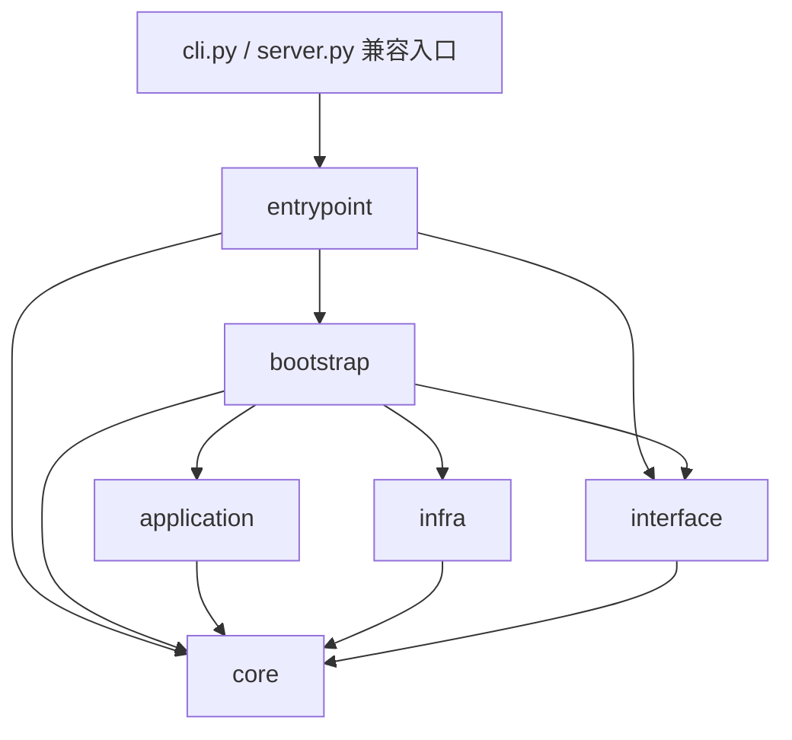

# EvernightAI 项目结构

EvernightAI 由 Python 3.12+ 分层后端和 Vue 3 / TypeScript 前端组成。
后端组织模型服务、聊天、Agent、工具、技能、上下文、记忆和持久化；
前端提供工作区、聊天与图片生成页面。

本文用于定位代码和理解职责。详细依赖与执行行为见
[架构依赖说明](architecture-dependencies.md)，完整关系图见
[架构图](architecture-diagrams.md)，接口列表见 [HTTP API](http-api.md)。

## 目录总览

```text
EvernightAI/
|-- src/EvernightAI/
|   |-- core/
|   |   |-- domain/          领域行为、管理器、策略和运行时
|   |   |-- protocol/        跨模块使用的接口契约
|   |   |-- schema/          请求、响应、状态及配置数据模型
|   |   `-- error/           领域异常
|   |-- application/         用例编排与 Agent 执行、恢复
|   |-- infra/
|   |   |-- adapters/        provider、SQLite、工具、MCP、沙箱实现
|   |   |-- registrations/   向工厂和注册表接入具体实现
|   |   `-- sqlite.py        SQLite 连接与迁移基础设施
|   |-- interface/
|   |   |-- http/            FastAPI、鉴权、路由、SSE、WebSocket
|   |   |-- cli/             命令操作、配置解析与日志
|   |   `-- log_store.py     接口层日志存储
|   |-- bootstrap/           具体运行时、服务和 HTTP 应用装配
|   |-- entrypoint/          命令分发与进程启动
|   |-- cli.py               CLI 兼容入口
|   `-- server.py            服务器兼容入口
|-- frontend/
|   |-- index.html           工作区入口
|   |-- chat.html            聊天入口
|   |-- images.html          图片生成入口
|   |-- src/
|   |   |-- api/             JSON、SSE、WebSocket 请求与认证
|   |   |-- domain/          工作区资源与聊天、图片数据转换
|   |   |-- runtime/         聊天操作协调及共享运行逻辑
|   |   |-- state/           工作区与聊天 XState 状态机
|   |   |-- components/      页面、交互控件与展示逻辑
|   |   `-- styles/          共享样式、聊天和图片页面样式
|   `-- tests/               单元与浏览器测试
|-- tests/                   后端行为、架构与可选真实服务测试
|-- docs/                    架构与功能文档
|-- examples/skills/         可导入技能模板示例
|-- config.toml.example      运行配置示例
|-- pyproject.toml           Python 依赖、打包、命令与测试配置
|-- pyrightconfig.json       后端类型检查配置
`-- AGENTS.md                协作规则与架构约束
```

## 后端各层职责

| 层 | 负责什么 | 定位入口 |
| --- | --- | --- |
| `core` | 定义领域行为、协议、数据模型和异常。包含可执行的 Manager 与策略 | [RuntimeKernel](../src/EvernightAI/core/domain/runtime.py)、[接口协议](../src/EvernightAI/core/protocol/interface.py) |
| `application` | 通过 core 协议组合上下文、记忆与技能，协调模型调用、工具循环和运行恢复 | [ChatApplication](../src/EvernightAI/application/chat.py)、[Agent 服务入口](../src/EvernightAI/application/agent.py) |
| `infra` | 实现 core 协议，处理服务 SDK、SQLite、文件、进程、网络与 MCP | [适配器目录](../src/EvernightAI/infra/adapters/)、[注册目录](../src/EvernightAI/infra/registrations/) |
| `interface` | 将 HTTP / CLI 输入转成 core 数据模型，处理认证、响应编码和异常映射 | [HTTP app](../src/EvernightAI/interface/http/app.py)、[CLI commands](../src/EvernightAI/interface/cli/commands.py) |
| `bootstrap` | 选择具体实现，创建管理器、存储和应用服务，并装配对外接口 | [runtime](../src/EvernightAI/bootstrap/runtime.py)、[interface](../src/EvernightAI/bootstrap/interface.py)、[config](../src/EvernightAI/bootstrap/config.py)、[http](../src/EvernightAI/bootstrap/http.py) |
| `entrypoint` | 解析启动参数、分发命令、启动服务器，并向 bootstrap 请求已装配对象 | [cli](../src/EvernightAI/entrypoint/cli.py)、[server](../src/EvernightAI/entrypoint/server.py) |

`core/domain` 中的 `EvernightInterface` 聚合已经注入的服务角色，
`RuntimeKernel` 持有管理器、策略、存储协议和生命周期。
它们的具体组件由 `bootstrap` 提供。

### 应用服务的保留标准

应用服务承载跨角色协调、请求转换或执行策略。仅把调用转交给一个已有管理器、
并改一下方法名的服务，可以通过统一内部契约后直接接入该管理器。

| 原服务 / 角色 | 当前处理 | 原因 |
| --- | --- | --- |
| `SkillApplication` | 删除，`interface.skills` 直接使用 `runtime.skills` | 列表、模板管理、能力查询与渲染都由 `SkillManager` 完成 |
| `DataAnalysisApplication` | 删除，`interface.data_analysis` 直接使用 `runtime.data_analysis` | 六个方法只做转发，接口与 runtime 共用 `DataAnalysisManageProtocol` |
| `ProviderApplication` | 保留 | 创建和更新后返回信息、连接测试的超时与错误映射、图片用例转交 |
| `SessionApplication` | 保留 | 确保 context 存在，组合会话默认配置和请求，协调 Chat / Agent |
| `ChatApplication` | 保留 | 请求组合、技能注入、上下文读写及流式生命周期 |
| `ImageApplication` | 保留 | 生成记录、所有权作用域、持久化警告与图片归档 |
| Agent 应用模块 | 保留 | 多轮执行、审批、持久化、恢复和生命周期管理 |
| `Authorized*Interface` | 保留 | 调用前进行权限检查，并为需要隔离的资源绑定作用域 |

`bootstrap.interface` 直接装配已有的 tool、skill 和 data-analysis manager。
这些角色通过结构化协议接入，装配不需要类型强转。
HTTP 路径、OpenAPI operation ID、CLI 命令和权限动作名称不随内部方法改名而变化。
Python 调用方使用 manager 的规范方法名，例如 `interface.skills.render`、
`interface.skills.create_template`、`interface.data_analysis.statistics`。

### 模块依赖关系

下面的箭头表示源码 import 方向；请求的执行顺序见下一节。



这些边界由 [架构测试](../tests/test_architecture_rules.py) 保护：

- `core` 不反向依赖外层；`application`、`infra`、`interface` 的项目内跨层依赖集中到 `core`。
- 具体 infra import 只出现在 `infra` 自身和 `bootstrap`。
- `bootstrap` 是具体组件的统一装配边界，内层不能反向调用它。
- HTTP / CLI 消费 `EvernightInterfaceProtocol`，运行时装配留在 `bootstrap`。
- package `__init__.py` 只保留注释，模块入口使用明确的文件路径。

协议直接继承 `typing.Protocol` 并声明实际契约，不设置空的项目级、职责级
或领域级分类基类。新增协议应有明确消费者或替换边界，避免为分类复制已有契约。

## 启动与请求链路

### 启动装配

`pyproject.toml` 声明 `evernight` 和 `evernight-http` 两个命令：

```text
evernight
  -> entrypoint.cli
  -> interface.cli.config.load_config
  -> bootstrap.config.create_interface_from_config
  -> 已装配 interface -> CLI commands

evernight-http / evernight serve
  -> entrypoint.server.serve
  -> interface.cli.config.load_config
  -> bootstrap.http.create_app_from_config
  -> 已装配 FastAPI app -> uvicorn
```

配置驱动的装配在 `bootstrap.config` 中创建 SQLite runtime，选择沙箱、
配置工具来源和数据源，再由 `bootstrap.interface` 绑定应用服务。
HTTP app 的 lifespan 负责调用注入的初始化与关闭逻辑。
运行时初始化恢复持久化 provider 配置并加载工具来源。

另一个 HTTP 工厂是 `bootstrap.http.create_app`，可供 uvicorn 的
`--factory` 模式调用；它通过参数和环境变量创建运行时，默认数据库路径为
`.evernight/runtime.sqlite3`。

### 聊天与 Agent

```text
HTTP route / CLI command
  -> EvernightInterfaceProtocol
  -> 可选 AuthorizedEvernightInterface 权限与作用域检查
  -> ChatApplication / AgentRunApplication
  -> 请求组合与 provider 调用
  -> ProviderManager -> provider adapter -> 外部模型服务
  -> 统一 ChatResponse / ChatStreamEvent
```

直接 chat 和带 context 的 chat 有不同的请求组合路径。
带 context 的调用通过 [ChatRequestComposer](../src/EvernightAI/application/chat_request.py)
选择 memory、组织 context 并渲染 skill，再调用 provider。
流式语义在 core 中使用事件协议表达，HTTP 层将事件编码成 SSE。

前端聊天发送的是持久化 `/agent-runs` 请求。Agent 可以进行多轮模型调用，
通过 `ToolManager` 检查工具安全与审批，执行工具并把结果交给后续模型调用。
运行状态、trace 和工具执行记录由相应存储保存。

Agent 应用模块按职责拆分如下：

| 模块 | 职责 |
| --- | --- |
| [agent.py](../src/EvernightAI/application/agent.py) | 公开服务入口与兼容导出 |
| [agent_execution.py](../src/EvernightAI/application/agent_execution.py) | 模型与工具循环、审批处理、上下文和记忆写入 |
| [agent_runs.py](../src/EvernightAI/application/agent_runs.py) | 持久化运行、流式输出、暂停、恢复、重试与取消 |
| [agent_recovery.py](../src/EvernightAI/application/agent_recovery.py) | 检查点校验、快照与 trace 对齐、启动恢复 |
| [agent_lifecycle.py](../src/EvernightAI/application/agent_lifecycle.py) | 活跃运行跟踪与共享关闭边界 |
| [agent_state.py](../src/EvernightAI/application/agent_state.py) | 控制状态、兼容 metadata 和用量汇总 |

### 图片生成

```text
images.html -> 图片组件 -> api/images.ts
  -> HTTP /images/generations
  -> interface.providers -> ProviderApplication -> ImageApplication
  -> runtime.providers -> OpenAI-compatible 图片适配器
  -> 生成结果 -> 图片记录保存与归档
```

图片 API 当前挂在 provider 接口角色下，应用编排实现在
[ImageApplication](../src/EvernightAI/application/image.py)。
[infra/adapters/images](../src/EvernightAI/infra/adapters/images/)
处理 SQLite 图片记录、URL 图片归档和位图数据。
历史记录也通过 `/images/records` 和 provider 接口角色访问。
详细行为见 [图片生成说明](image-generation.md)。

## 前端职责与入口

前端由 [vite.config.ts](../frontend/vite.config.ts) 配置三个页面入口：

| 页面 | 脚本 / 根组件 | 主要用途 |
| --- | --- | --- |
| `index.html` | [main.ts](../frontend/src/main.ts) / [App.vue](../frontend/src/App.vue) | 工作区资源与设置入口 |
| `chat.html` | [chat.ts](../frontend/src/chat.ts) / [ChatApp.vue](../frontend/src/ChatApp.vue) | 会话、消息、工具审批与运行详情 |
| `images.html` | [images.ts](../frontend/src/images.ts) / [ImageApp.vue](../frontend/src/ImageApp.vue) | 图片生成与历史记录 |

`api` 提供传输与认证；`domain` 将 API 数据转成页面使用的概念；
`runtime` 协调聊天请求、取消及断线恢复；`state` 推进工作区与聊天生命周期；
`components` 消费状态并维护弹窗、表单等局部交互状态。

工作区加载由 `workspaceMachine` 调用 `domain/workspace.loadWorkspace`，
聚合 provider、会话、记忆、工具、技能、数据源和 Agent run。
聊天由 `chatMachine` 调用 `chatRuntime`，接收 trace 与快照并更新展示数据。
图片生成和历史请求当前直接由图片组件调用 API，局部请求状态由组件维护。
三个入口都启动 `workspaceRuntime`，共享工作区加载和身份切换处理。

开发时 Vite 代理后端 API 和 WebSocket，默认目标为 `http://127.0.0.1:8000`；
部署时 FastAPI 可通过配置挂载 `frontend/dist`。
组件约定与接口覆盖见 [前端说明](../frontend/README.md) 和
[接口覆盖表](../frontend/INTERFACE_COVERAGE.md)。

## 按功能定位代码

下表中的路径均相对 `src/EvernightAI/`；前端组件路径相对 `frontend/src/components/`。

| 功能 | 核心契约 / 行为 | 应用与具体实现 | HTTP / 前端位置 |
| --- | --- | --- | --- |
| Provider | `core/domain/provider.py`、`core/protocol/provider.py` | `application/provider.py`、`infra/adapters/providers/`、`infra/registrations/provider/` | `routes/providers.py`、`providers/`、`settings/ProviderSettings.vue` |
| Chat | `core/schema/content.py`、`core/protocol/stream.py` | `application/chat.py`、`application/chat_request.py` | `routes/chat.py`、`chat/` |
| Agent | `core/schema/agent.py`、`core/protocol/agent.py` | `application/agent*.py`、`infra/adapters/agent/` | `routes/agent_runs.py`、`executions/`、`chat/ChatRunDetails.vue` |
| Context | `core/domain/context.py`、`core/protocol/context.py` | `application/chat.py`、`infra/adapters/context/sqlite.py` | `routes/contexts.py`、`settings/ResourceSettings.vue` |
| Memory | `core/domain/memory.py`、`core/protocol/memory.py` | `application/chat.py`、`application/memory.py`、`infra/adapters/memory/sqlite.py` | `routes/memories.py`、`knowledge/`、`settings/MemorySettings.vue` |
| Session | `core/domain/session.py`、`core/protocol/session.py` | `application/session.py`、`infra/adapters/session/sqlite.py` | `routes/sessions.py`、`conversations/`、`chat/ChatSidebar.vue` |
| Skill | `core/domain/skill.py`、`core/protocol/skill.py` | `bootstrap/interface.py`、`application/skill_prompt.py`、`infra/adapters/skill/` | `routes/skills.py`、`skills/`、`settings/SkillSettings.vue` |
| Tool / MCP | `core/domain/tool.py`、`core/protocol/tool.py` | `infra/adapters/tool/`、`infra/registrations/tool/` | `routes/tools.py`、`capabilities/`、`chat/ChatToolApproval.vue` |
| Sandbox | `core/domain/sandbox.py`、`core/protocol/sandbox.py` | `infra/adapters/sandbox/`、`bootstrap/config.py` | 由受限进程工具使用 |
| Data analysis | `core/domain/data_analysis.py`、`core/protocol/data_analysis.py` | `bootstrap/interface.py`、`infra/adapters/data_analysis/` | `routes/data_analysis.py`、`settings/DataSettings.vue` |
| Image | `core/schema/image.py`、`core/protocol/image.py` | `application/image.py`、`infra/adapters/images/`、`infra/adapters/providers/openai_compatible/images.py` | `routes/images.py`、`images/` |
| Auth | `core/domain/auth.py`、`core/domain/authorized_interface.py` | `bootstrap/interface.py`、`bootstrap/http.py` | `interface/http/auth.py`、`settings/ApiKeySettings.vue` |
| Workspace | `core/protocol/workspace.py`、`core/schema/workspace.py` | `infra/adapters/tool/workspace_directory.py` | `routes/workspaces.py`、`chat/WorkingDirectoryPicker.vue` |

表中的 `routes/` 均指 `interface/http/routes/`。
后端 workspace API 管理工作目录；前端 `domain/workspace` 则聚合多类资源，
二者的职责范围不同。

Context 组织当前模型可见窗口；memory 选择持久知识；skill 渲染可复用提示词；
tool 执行具体动作；Agent 在多轮执行中协调这些能力。

## 测试与阅读顺序

[tests/](../tests/) 目前采用扁平命名，按文件名可找到领域、应用、接口、
适配器和架构测试。`tests/fakes/` 提供模型流、Agent 和 MCP 等测试替身。
真实 provider 与图片测试需显式启用，默认跳过。

[frontend/tests/](../frontend/tests/) 中，`*.test.ts` 是 Vitest 单元测试，
`*.browser.mjs` 是 Playwright 浏览器检查。运行命令定义在
[frontend/package.json](../frontend/package.json)；后端检查要求见
[AGENTS.md](../AGENTS.md)。

建议按以下顺序阅读：

1. `core/protocol/interface.py` 与 `core/domain/runtime.py`：理解对外角色与运行时能力。
2. `bootstrap/runtime.py` 与 `bootstrap/interface.py`：理解具体组件如何装配。
3. `interface/http/routes/chat.py`、`application/chat.py` 与 `application/chat_request.py`：沿聊天请求跟踪编排。
4. `application/agent.py`、`agent_runs.py` 与 `agent_execution.py`：理解多轮执行与持久化。
5. 对应 provider 或存储适配器，以及同功能测试：核对具体行为。
6. `frontend/src/chat.ts`、`state/chatMachine.ts`、`runtime/chatRuntime.ts` 和 `components/chat/ChatView.vue`：串联浏览器交互与后端运行。
